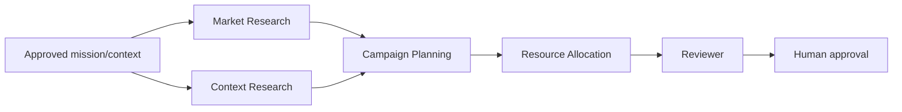

# ACS v2 Canonical Contracts

**Status:** `PROPOSED`  
**Schema/code changes:** not authorized by this document

## Design rule

Canonical ACS contracts represent institutional intent and history. Provider
adapters translate these records into provider-native operations and translate
provider events back into ACS evidence.

## Agent contract

The current `AgentDefinition` and `AgentRevision` are the primary baseline.
Discovery should determine additive evolution for the following shape:

```text
Agent
  identity: agentId, name, domain, ownerOrganization
  lifecycle: status, revision, fingerprint, supersedes
  purpose: role, responsibilities, prohibitedResponsibilities
  composition: instructions, profile, skills, tools, capabilities
  knowledge: allowedScopes, deniedScopes, sourcePolicies, retentionPolicy
  execution: runnerPreferences, enginePreferences, modelStrategy
  authority: policyRefs, mandateRefs, approvalRules, budgetLimits
  evidence: evaluationRefs, validationState, requiredEvidence
  projection: externalProviderRefs[]
```

Required invariants:

- agent identity is not a model, provider, runtime, or process;
- a revision is immutable after adoption;
- provider projections reference the ACS revision and cannot silently mutate it;
- tools and knowledge are allowlisted and domain-scoped;
- shared agents do not inherit product context by default;
- secret values are never embedded in the definition.

## Workforce contract

A workforce is a revisioned composition, not another name for an agent.

```text
WorkforceDefinition
  workforceId
  version/revision
  ownerOrganization
  productDomain
  purpose
  memberSlots[]
  coordinatorPolicy
  contextPolicy
  approvalPolicy
  failurePolicy
  evidencePolicy
  persistenceMode: temporary | persistent
```

Each member slot references an eligible agent identity/revision or a selection
constraint. Runtime membership is recorded separately so that replacing an
agent revision does not rewrite historical runs.

## Workflow contract

```text
WorkflowDefinition
  workflowId
  version/revision
  ownerOrganization
  productDomain
  inputsSchemaRef
  outputsSchemaRef
  tasks[]
  edges[]
  approvals[]
  retryPolicy
  timeoutPolicy
  compensationPolicy
  evidencePolicy
```

Task requirements include:

- stable task ID and optional parent task;
- agent/workforce slot;
- typed input/output references;
- allowed tools and knowledge scope;
- authority and approval requirements;
- resource/budget limits;
- idempotency key semantics;
- retry and terminal failure behavior;
- evidence required for completion.

## Orchestration interfaces

Names are illustrative; compatibility with existing ACS interfaces must be
reviewed before coding.

```text
IAgentRegistry
  resolve(agentId, revision)
  listEligible(constraints)
  recordProjection(providerRef)

IWorkflowRegistry
  resolveWorkflow(workflowId, revision)
  resolveWorkforce(workforceId, revision)

IOrchestrator
  capabilities()
  plan(canonicalWorkflow, canonicalWorkforce, executionContext)
  start(authorizedPlan)
  inspect(runId)
  interrupt(runId, reason)
  resume(runId, approvalRef)
  cancel(runId, reason)
  events(runId, cursor)

IExecutionProvider
  health()
  capabilities()
  execute(authorizedTask)
  inspect(executionId)
  cancel(executionId)

IKnowledgeProvider
  resolve(scopedReferences)
  snapshot(scopedReferences)
  describeProvenance(contextArtifactId)

IGovernancePolicy
  evaluate(action, actor, organization, domain, mandate, evidence)

IEvidenceStore
  append(event)
  linkArtifact(artifact)
  query(lineageFilter)
  verify(runId, completenessPolicy)
```

`IExecutionProvider` should be compared with existing `AgentEngine` and
`AgentRunner`; it may become an umbrella concept in documentation rather than a
new duplicate interface.

## Execution context

Every orchestration and execution request must carry explicit context:

```text
organizationId / tenantId
productDomain
actor
mandateRefs
governancePolicyRefs
workflowRevision
workforceRevision
agentRevision(s)
knowledgeScopeRefs
toolScope
resourceLimits
approvalState
correlationId
idempotencyKey
evidencePolicy
```

The public/surface label is Organization. The wire field may remain `tenantId`
until a separately versioned compatibility change is approved.

## Evidence contract

Minimum canonical record for a meaningful run:

| Field | Requirement |
| --- | --- |
| `runId`, `workflowId`, revision | Required |
| workforce ID/revision and runtime membership | Required for workforce runs |
| task ID and parent/dependencies | Required per task |
| agent ID/revision | Required per task |
| Organization/tenant and product domain | Required |
| actor, mandate, policy, approval | Required when authority is evaluated |
| source and knowledge references | Required when external/institutional context is consumed |
| orchestrator/provider/engine/runner/model versions | Required when used |
| tool calls and redacted results | Required according to risk and retention policy |
| outputs and artifact hashes/URIs | Required for produced artifacts |
| validation, reviewer, decision, confidence state | Required when applicable |
| cost/usage | Required when metered and available; never fabricated |
| failure, retry, cancellation, compensation | Required for non-happy paths |
| timestamps and lineage | Required |

Evidence completeness must be evaluated by policy. Missing provider telemetry
must be represented as unavailable, not synthesized.

## BBA reference workflow contract

The discovery PoC candidate uses five representative capability slots:



This is a comparison workload only. BBA Agency must confirm the canonical role
names, schemas, permissions, and whether these agents exist as implemented or
planned entities before a PoC is authorized.

Acceptance probes for each candidate orchestrator:

- parallel research branches remain isolated and join deterministically;
- one task failure is visible and retryable without duplicating completed work;
- handoff context is typed and excludes unrelated Axodus domains;
- reviewer output cannot satisfy human approval automatically;
- removing the candidate provider leaves ACS definitions and evidence intact;
- the entire run can be reconstructed from ACS records.
