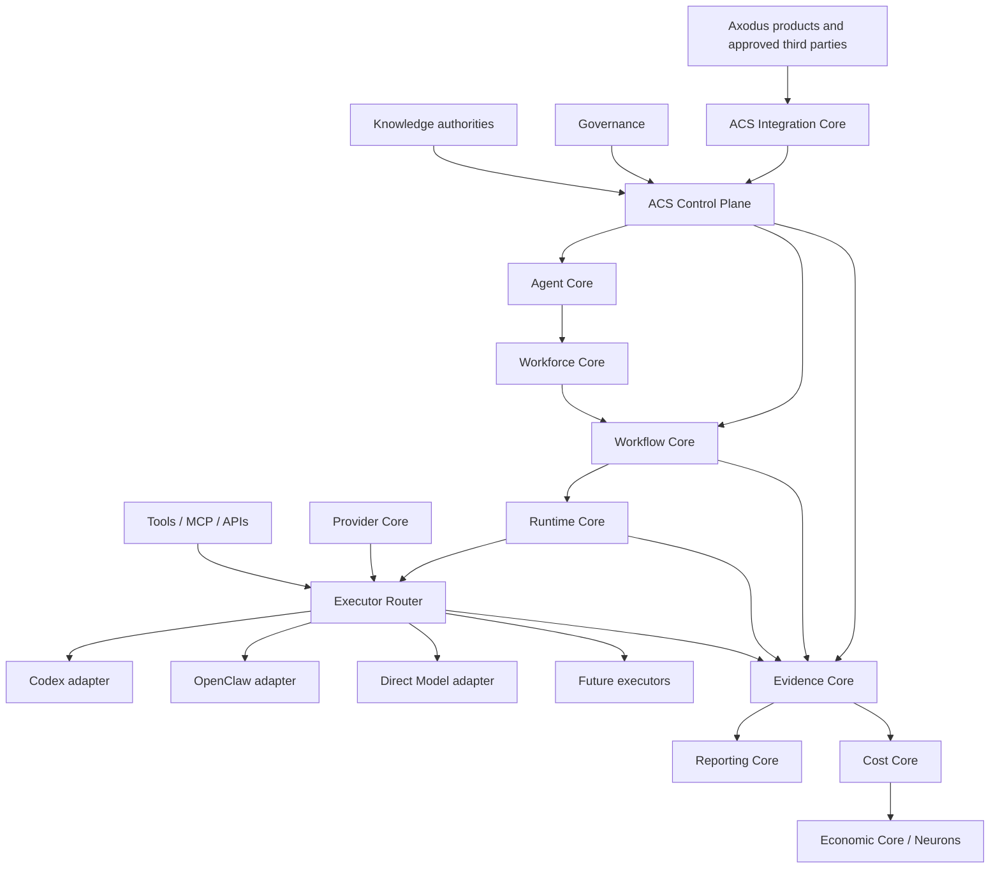

# ACS v2 Unified Core Architecture

**Status:** `PROPOSED DESIGN / EVIDENCE-BACKED IMPLEMENTATION BLUEPRINT`
**Audit date:** 2026-09-10
**Runtime, provider, financial, and production mutations:** none

## 1. Executive architecture decision

The target is an ACS-native system, not a permanent chain of ACS, Agenta, Eigent, and CAMEL applications.



The long-term workforce path is:

```text
ACS Workforce and Workflow Cores
        -> optional, replaceable planner proposal
        -> ACS validated and persisted task graph
        -> task workload extension over ACS durable runtime jobs/workers/leases
```

Eigent should not remain a runtime dependency. CAMEL may be evaluated only as a removable planner/graph-proposal adapter by default. ACS currently owns durable runtime, governance, and economic foundations; ACS v2 proposes the canonical graph, context and institutional evidence contracts.

## 2. Cross-system capability matrix

The cells summarize the audited implementation. `Partial` means a useful mechanism exists but does not satisfy the ACS-owned canonical contract.

| Capability | ACS | Agenta | Eigent | CAMEL | Proposed owner | External strategy |
|---|---|---|---|---|---|---|
| Agent identity | Stable `AgentDefinition`/`AgentRevision` IDs | Aliased through workflow/application/evaluator artifacts | Desktop/runtime identities | `ChatAgent`/node runtime identity | ACS Agent Core | Agenta **REIMPLEMENT**; preserve ACS |
| Agent definition | Composition references and model strategy | Strong neutral `AgentTemplate` | App configuration | Agent configuration | ACS Agent Core | Agenta **ADAPT** |
| Agent versioning | Normalized definition fingerprints and revision controls; durable immutability is not yet a universal store guarantee | Artifact/variant/revision/commit/fork DTO vocabulary | No suitable canonical aggregate | No suitable canonical aggregate | ACS Agent Core | Agenta **ADAPT** |
| Skills | Referenced composition resources | First-class typed resolution/materialization | Integrates skills | Agent/tool ecosystem support | ACS Resource Registry | Agenta **ADAPT** |
| Tools | Referenced resources and policy boundaries | Typed normalization and callbacks | Desktop tool services | Toolkits on `ChatAgent` | ACS Tool Core | Agenta/CAMEL **ADAPT** |
| MCP | Contract/risk-gate surface; no general canonical model | Declarative and resolved server models | MCP integration | Tool ecosystem support | ACS Tool Core | Agenta **ADAPT**, Eigent UI **REJECT** |
| Provider abstraction | Provider/model/credential registries and resolver | Author reference vs resolved connection | Model selection in app | Model backend used by agents | ACS Provider Core | Preserve ACS; Agenta **ADAPT** |
| Harness abstraction | Implicit; OpenClaw materialization leaks into composition | Explicit harness kinds and capability negotiation | Desktop executor wiring | `ChatAgent` centric | ACS Executor Core | Agenta **ADAPT** |
| Executor abstraction | `AgentEngine`, `AgentRunner`, target, worker | Sidecar/sandbox-agent runtime | Desktop backend and tools | In-process agent execution | ACS Runtime/Executor Cores | External runtimes **ADAPT** |
| Workforce | Missing canonical aggregate | No ACS-fit workforce aggregate | Product-level workforce | Worker nodes/pools/coordinator | ACS Workforce Core | Eigent **REJECT** dependency; CAMEL **ADAPT/REIMPLEMENT** |
| Orchestration | Sequential deterministic flow plus durable job substrate | Evaluation/task queues, not canonical ACS workforce | App orchestration over CAMEL | Workforce execution modes | ACS Workflow Core | CAMEL **ADAPT**, durable semantics **REIMPLEMENT** |
| Task DAG | Missing canonical graph | No suitable workforce DAG | App projections | Dependencies, pipeline and cycle checks | ACS Workflow Core | CAMEL **ADAPT** algorithm, **REIMPLEMENT** store/state |
| Parallelism | Worker capacity and dispatch substrate | Queue/worker infrastructure | Parallel desktop execution | Worker listeners/pools and async gather | ACS Runtime Core | Preserve ACS substrate; CAMEL **ADAPT** planning |
| Context | Partial resource and tenant scope | Session context and hidden bindings | Coordinator/app context | Shared/workforce memory | ACS Context Core | External models **REIMPLEMENT** under ACS policy |
| Knowledge | No general canonical knowledge graph | Prompt/session inputs | App-specific | Memory and agent context | Owning product + ACS references | **REIMPLEMENT** ACS reference layer |
| Governance | Tenant policy, identity, secret and approval boundaries | OSS RBAC plus sandbox/tool policy declarations and HITL; universal enforcement was not proven | TaskLock/policy runtime | Limited runtime policy | Governance + ACS enforcement | Agenta/Eigent **ADAPT concepts**, contracts **REIMPLEMENT** |
| Evidence | Audit, operational evidence, correlation and read models | Session events and OTel tracing | Run journal/SSE projections | Callbacks/snapshots | ACS Evidence Core | Provider telemetry **ADAPT** as input |
| Provenance | Partial entity/correlation references | Revision commits, spans, artifacts | Journal/runtime IDs | Task/node IDs | ACS Evidence Core | **REIMPLEMENT** full lineage |
| Reporting | Product API read projections | Analytics/evaluation UI | Desktop views | Callbacks only | ACS Reporting Core | External UIs **REJECT** |
| Cost accounting | Usage/economic foundation | Token/cost trace aggregates only | No canonical allocation | Usage on agents, no ACS hierarchy | ACS Cost Core | External usage **ADAPT**; allocation **REIMPLEMENT** |
| Integrations | Product API, HTTP, workers, providers | API/SDK/webhooks/streams | Local API/SSE/tools | Python library callbacks | ACS Integration Core | Patterns **ADAPT**; native APIs **REJECT** as product boundary |
| Persistence | Durable runtime/economic state plus in-memory repositories | Postgres/Redis/DAOs | SQLite/app state | In-memory task/channel/snapshots | Each ACS core owns authoritative store | External schemas **REIMPLEMENT** |
| Security | Tenant/governance/secrets/isolation controls | Platform RBAC and sandbox/tool controls | Desktop locks/policy | Framework-level controls | Governance + ACS Security | External security **ADAPT**, never canonical |

## 3. Reuse decision ledger

| Source capability | Decision | Evidence-based rationale | ACS destination |
|---|---|---|---|
| Agenta artifact/variant/revision lineage | **ADAPT** | Useful revision/variant/commit/fork vocabulary and DTO pattern, but storage immutability was not proven and its workflow-backed artifact-family identity does not preserve the ACS Agent boundary. | Agent revision repository and projection metadata |
| Agenta `AgentTemplate` | **ADAPT** | Separates instructions, resources, runtime selectors and harness fields. Placement, sandbox and authorization must leave the canonical definition. | Agent authoring schema and compiler |
| Agenta provider reference/resolved connection | **ADAPT** | Clean separation between authored route and resolved credential; Agenta project/vault semantics are platform-specific. | Provider route resolver and credential binding |
| Agenta skills/tools/MCP normalization | **ADAPT** | Typed resolvers and compilation are reusable concepts. ACS needs version, provenance, policy, domain and evidence metadata. | Resource compiler |
| Agenta harness capability negotiation | **ADAPT** | Prevents unsupported combinations and cleanly separates harness from backend. Current implementation targets coding harnesses. | Harness contract and executor eligibility |
| Agenta runner/sidecar/session implementation | **REIMPLEMENT** | Coupled to sandbox-agent/ACP, provider platform services and its session hierarchy. | Existing ACS Runtime Core plus adapters |
| Agenta OTel tracing and sequenced session events | **ADAPT** | Useful interoperability and ordered-event patterns, but cannot be the institutional ledger. | Evidence ingest/export adapters |
| Agenta SaaS UI, workspace/org, billing, RBAC role catalog/API scopes and `ee/` | **REJECT** | Duplicates Axodus boundaries, adds platform assumptions, and `ee/` has restrictive licensing. The three-plane separation of platform authorization, execution authority and per-action approval remains an **ADAPT concept**. | None |
| Eigent desktop app, local SSE, TaskLock and browser cleanup | **REJECT** | Tight UI/application-state coupling and duplicate runtime ownership. | None |
| Eigent journal ordering and approval behavior | **ADAPT** | Ordering is useful but the workforce projection is fail-open on persistence error; it is not a durable dispatch guarantee. ACS must implement an authoritative transaction/outbox. | ACS evidence/outbox and approval state machine |
| CAMEL `Task`, dependencies, pipeline/cycle validation | **ADAPT** | Good task-graph mechanics; runtime identity and state are framework-specific and in-memory. | Task graph compiler/validator PoC |
| CAMEL coordinator, decomposition, assignment rationale and graph checks | **ADAPT** | Useful planning mechanisms behind an interface; `ChatAgent` and CAMEL execution state must not leak into ACS contracts. | Removable planner/graph-proposal adapter |
| CAMEL channels, snapshots, recovery state machine | **REIMPLEMENT** | In-memory persistence and callbacks cannot satisfy ACS durability, replay, isolation or institutional evidence. | ACS Workflow/Runtime/Evidence Cores |
| Existing ACS Agent, Provider, Engine, Runner, Target, Worker, Governance and Economics | **ADOPT** internally | Existing ACS-owned foundations have source and historical implementation evidence. The durable runtime is the current `runtime.start` job substrate; graph workloads and state remain proposed additive work. Readiness remains constrained by `ACS-BLOCKER-014`, topology limits and provenance/license gaps. | Extended in place |

## 4. Canonical Agent specification

**Proposed V2 invariant:** `Agent` is stable identity; `AgentRevision` is immutable authored intent; `ExecutionBinding` is a run-scoped resolved projection. Current ACS fingerprints normalized definitions and enforces revision conflicts, but the V2 repository must still prove no-update/delete lineage semantics.

```yaml
Agent:
  identity:
    agent_id: string
    name: string
    organization_id: string
    product_domain: string
    ownership_ref: string
    sharing_mode: private | domain_shared | explicitly_shared
  lifecycle:
    status: draft | active | disabled | archived
    current_revision: integer
    created_at: timestamp
    updated_at: timestamp

AgentRevision:
  agent_id: string
  revision: integer
  fingerprint: sha256
  supersedes_revision: integer?
  definition:
    role_ref: ResourceRevisionRef?
    instructions: string
    capability_requirements: [CapabilityRef]
    constraints: [ConstraintRef]
  knowledge:
    allowed_scope_refs: [KnowledgeScopeRef]
    denied_scope_refs: [KnowledgeScopeRef]
    context_policy_ref: PolicyRevisionRef
    memory_policy_ref: PolicyRevisionRef
  resources:
    skill_refs: [ResourceRevisionRef]
    tool_refs: [ResourceRevisionRef]
    mcp_server_refs: [ResourceRevisionRef]
  runtime_preferences:
    provider_routes: [ProviderRouteRef]
    model_requirements: [CapabilityRef]
    harness_preferences: [HarnessRef]
    executor_preferences: [ExecutorRef]
  governance:
    authority_refs: [AuthorityRef]
    permission_policy_ref: PolicyRevisionRef
    approval_policy_ref: PolicyRevisionRef
  economics:
    cost_policy_ref: PolicyRevisionRef
    budget_policy_ref: PolicyRevisionRef
    settlement_policy_ref: PolicyRevisionRef?
  evidence:
    audit_policy_ref: PolicyRevisionRef
    evaluation_refs: [EvaluationRef]
  commit:
    created_by: ActorRef
    committed_at: timestamp
    change_reason: string
```

Invariants:

- A model, provider, harness, executor, runtime process, workforce slot, or external provider ID never becomes the Agent identity.
- V2 revisions are immutable by contract; policy/resource binding rules must specify whether change creates a new Agent revision, a plan snapshot, or both.
- Credential values never enter these records.
- Shared agents receive no product context, memory, credentials, budget, or authority by default.
- The existing ACS fingerprint and optimistic revision controls remain authoritative.
- `openclaw-compatible` moves out of `AgentComposition` into an OpenClaw harness/materializer adapter.
- Revision preferences declare capability requirements and approved route classes. The actual provider, model, credential, harness, executor and target are resolved per run into a policy-snapshotted `ExecutionBinding`.

Agenta accelerates the authored-template, resource compilation, provider-route and harness-capability portions. It does not replace the ACS aggregate or repository.

## 5. Canonical Workforce specification

```yaml
Workforce:
  identity:
    workforce_id: string
    name: string
    organization_id: string
    product_domain: string
  lifecycle:
    status: draft | active | disabled | archived
    current_revision: integer

WorkforceRevision:
  workforce_id: string
  revision: integer
  fingerprint: sha256
  objective:
    description: string
    input_schema_ref: SchemaRef
    output_schema_ref: SchemaRef
  member_slots:
    - slot_id: string
      fixed_agent_revision_ref: AgentRevisionRef?
      selection_constraints: [ConstraintRef]
      responsibilities: [string]
      required_capabilities: [CapabilityRef]
  coordinator_policy:
    mode: deterministic | agentic | hybrid
    coordinator_slot_id: string?
    planner_adapter_ref: AdapterRef?
  workflow_revision_ref: WorkflowRevisionRef
  execution_policy_ref: PolicyRevisionRef
  concurrency_policy_ref: PolicyRevisionRef
  retry_policy_ref: PolicyRevisionRef
  context_policy_ref: PolicyRevisionRef
  budget_policy_ref: PolicyRevisionRef
  approval_policy_ref: PolicyRevisionRef
  evidence_policy_ref: PolicyRevisionRef
  persistence_mode: ephemeral | durable
  commit: RevisionCommit
```

Runtime membership is a separate `WorkforceRunMembership` record that freezes the chosen Agent revisions for each run. CAMEL can accelerate future planner, decomposition, assignment-rationale and graph-validation PoCs; Eigent contributes no long-term canonical dependency. CAMEL cannot own dispatch, workers, channels, retry state, checkpoints or run completion.

## 6. Workflow and coordination specification

**Proposed V2 contracts:** a `WorkflowRevision` owns an immutable graph, a `WorkflowRun` owns graph-level runtime state, a `TaskRun` identifies a logical node execution, and `TaskAttempt` records each execution attempt. None of these graph guarantees exists in the current linear workflow implementation.

```yaml
WorkflowRevision:
  workflow_id: string
  revision: integer
  organization_id: string
  product_domain: string
  orchestration_mode: deterministic | dynamic | hybrid
  input_schema_ref: SchemaRef
  output_schema_ref: SchemaRef
  nodes: [TaskNode]
  edges: [TaskEdge]
  policies:
    retry: PolicyRevisionRef
    timeout: PolicyRevisionRef
    cancellation: PolicyRevisionRef
    compensation: PolicyRevisionRef
    approval: PolicyRevisionRef
    evidence: PolicyRevisionRef

TaskNode:
  task_id: string
  node_type: action | planner | reviewer | approval | join | condition | compensation
  assigned_slot_ref: string?
  input_refs: [DataRef]
  output_schema_ref: SchemaRef?
  allowed_tool_refs: [ResourceRevisionRef]
  knowledge_scope_refs: [KnowledgeScopeRef]
  authority_refs: [AuthorityRef]
  resource_limits: ResourceLimits
  retry_policy_ref: PolicyRevisionRef?
  timeout_policy_ref: PolicyRevisionRef?
  join_mode: all_required | any_success | quorum?
  quorum: integer?
  idempotency_scope: string

TaskEdge:
  from_task_id: string
  to_task_id: string
  condition_ref: ConditionRef?
```

The state machine supports `planned`, `blocked`, `ready`, `leased`, `running`, `awaiting_approval`, `succeeded`, `failed_retryable`, `failed_terminal`, `cancelled`, `compensating`, and `compensated`.

### 6.1 Deterministic graph and attempt semantics

A graph revision must specify the conditions under which every downstream edge becomes `satisfied`, `skipped`, `blocked`, `failed`, or `cancelled`. A `join` node declares exactly one mode: `all_required` (the default), `any_success`, or `quorum` with an explicit threshold. It becomes ready only when its declared condition is provable from terminal inbound-edge states; one upstream success satisfies only an explicitly declared `any_success` join. Non-selected or unreachable branches are marked skipped; the revision states whether remaining active branches must finish or be cancelled. The graph evaluator records the inbound edge identities and outcome used for the decision.

A `TaskRun` is the logical work item. Each admitted execution attempt creates a separate `TaskAttempt` (delivery retransmissions retain that attempt), linked to the same TaskRun and its stable logical idempotency key. A retry is admitted only after the failure class, retry policy, remaining deadline, budget/reservation state, authority, approval state, and execution binding are revalidated. The attempt-specific dispatch key deduplicates command acceptance while preserving the logical operation identity. It does not prove exactly-once external effects; an unknown tool outcome requires reconciliation before retry. Earlier attempts remain immutable evidence and cost inputs. Cancellation is terminal by default; any later resume is a newly admitted operation from a durable checkpoint and cannot silently requeue work.

A `condition` node persists its evaluated expression, input references, policy/version, and selected branch. Compensation is declared by the WorkflowRevision, references a completed compensable action, receives its own authority/evidence/budget admission, and never authorizes arbitrary executor commands.

Deterministic orchestration executes a prevalidated graph. Dynamic orchestration may propose nodes or edges, but ACS validates the amendment for schema, cycles, authority, isolation, budget, evidence and resource limits before committing a new plan revision. Reviewer output never satisfies human approval automatically.

Proposed compilation target:

```text
Workflow TaskRun
  -> new task workload envelope compatible with ACS RuntimeJob
  -> durable assignment + lease expiry + fencing token
  -> worker/target/engine/runner/executor
  -> result/outcome event
```

Current durable jobs support only `runtime.start`; they do not yet persist task dependencies, joins, checkpoints, approvals, compensation or workforce membership. A schema/state compatibility specification must prove this extension can reuse current retries, cancellation, capacity, leases and recovery without introducing a second queue. Durable assignments are fenced but not currently signed; any signed dispatch design requires a separate key-managed durable contract.

### 6.2 Governed graph amendments, handoffs and checkpoints

A dynamic planner emits an untrusted `GraphAmendmentProposal` with a base graph fingerprint, planner execution reference, typed add/remove/replace node or edge operations, reason, policy/budget references and expected task states. ACS applies compare-and-swap validation, refuses direct mutation of leased/running/completed tasks, and records acceptance or rejection. CAMEL never commits graph state.

A `TaskHandoff` is a durable ACS envelope carrying from/to execution references, target Agent revision and execution binding, context and artifact references, authority attenuation, expected output schema, idempotency and causation. CAMEL channel post/return is adapter-local plumbing and is not a handoff contract.

An ACS checkpoint is a proposed durable recovery boundary containing graph revision/fingerprint, TaskRun attempt, RuntimeJob/assignment/lease/fencing reference, executor handle/recovery capability, policy/resource/context refs, tool outcomes, pending approvals, artifact digests and evidence gaps. CAMEL snapshots and Eigent TaskLock histories are debug/interactive artifacts only.

## 7. Runtime, executor and provider specifications

### 7.1 Contract vocabulary

| Concept | Owns | Does not own |
|---|---|---|
| Provider | API/account boundary, available models, health, price/usage metadata | Agent identity, harness process, workflow policy |
| Model | Provider-scoped inference capability and version/name | Credentials, agent role, executor lifecycle |
| Harness | Converts an AgentRevision/task into executable prompts, resources, tool protocols and session semantics | Machine placement, provider account, canonical evidence |
| Executor | Runs work, manages execution handle, timeout/cancel/inspect, emits normalized events | Authority to choose itself or modify the canonical task |
| Engine | Deploys/materializes persistent runtime capabilities and targets | Canonical Agent or Workforce definition |
| Execution Target | Eligible environment with health, isolation and capability claims | Worker identity or workflow state |
| Worker | Runtime process/host identity, capacity and leases | Workforce composition |

### 7.2 Common execution protocol

```yaml
ExecutionRequest:
  request_id: string
  correlation_id: string
  organization_id: string
  product_domain: string
  workflow_run_id: string?
  workforce_run_id: string?
  task_run_id: string
  attempt: integer
  agent_revision_ref: AgentRevisionRef
  resolved_binding_ref: ExecutionBindingRef
  input_refs: [DataRef]
  context_artifact_ref: ArtifactRef
  allowed_resources: [ResourceRevisionRef]
  policy_snapshot_refs: [PolicySnapshotRef]
  resource_limits: ResourceLimits
  deadline: timestamp?
  idempotency_key: string
  required_evidence: [EvidenceRequirement]

ExecutionResult:
  execution_id: string
  status: accepted | running | succeeded | failed | cancelled | timed_out
  output_refs: [ArtifactRef]
  usage_records: [NormalizedUsage]
  event_cursor: string?
  error: NormalizedError?

ExecutionBinding:
  binding_id: string
  binding_status: proposed | admitted | rejected | superseded
  plan_fingerprint: sha256
  agent_revision_ref: AgentRevisionRef
  requested_provider_route_ref: ProviderRouteRef?
  selected_provider_ref: ProviderRef?
  selected_model_ref: ModelRef?
  credential_reference: CredentialReference?
  harness_ref: HarnessRef
  executor_ref: ExecutorRef
  engine_ref: EngineRef?
  target_ref: ExecutionTargetRef?
  capability_evidence_refs: [EvidenceRef]
  policy_snapshot_refs: [PolicySnapshotRef]
  economic_snapshot_refs: [EconomicSnapshotRef]
  admission_event_ref: EvidenceRef?
```

The AgentRevision contains preferences and constraints; the ExecutionBinding records a run-scoped selection after ACS resolves them. `binding_status` is a projection of lifecycle events, not permission to mutate binding content. `admission_event_ref` is required after an admission or rejection decision; only an admitted binding may dispatch. Planning evaluates eligible route classes without credential values. Admission validates the full provider, model, credential mode, endpoint/deployment, harness, executor and target tuple; it records capability evidence and fails closed when the tuple cannot be proven. The executor receives only a scoped credential/secret lease or connection handle, never a raw credential embedded in the binding.

An admitted TaskRun does not mutate its binding in place. Fallback, model substitution, executor transfer, or credential-mode change creates a replacement binding and an evidence event, then re-evaluates policy, entitlement, budget/reservation, and cost responsibility. This prevents provider-specific state from silently changing an Agent definition or a historical execution record.

All adapters implement `health`, `capabilities`, `execute`, `inspect`, `cancel`, and event streaming/polling. The execution-plan resolver remains the ACS-owned selection point.

### 7.3 Executor responsibilities

- **Codex:** bounded software engineering, repository analysis, code change, testing, technical research and architecture tasks. It receives explicit repository roots, tools, network/approval policy, deadline and evidence requirements. Official OpenAI Docs should be revalidated when its adapter PoC begins.
- **OpenClaw:** persistent schedules, monitoring, messaging, notifications, operational automation and long-running integrations. It remains behind `AgentEngine`; provenance/license blockers must be resolved before code adoption or role expansion.
- **Direct Model:** lightweight inference, classification, extraction, synthesis, structured generation and planner proposals that need no persistent harness.
- **Additional types:** HTTP/job executor for stable APIs, sandbox process/container executor for bounded binaries, and human task executor for approvals/reviews. These are protocol implementations, not new canonical agent types.

## 8. Platform Integration specification

Products consume ACS-owned versioned contracts through the existing Product API boundary. The paths below are illustrative proposed interfaces, not implemented endpoints.

| Requested operation | Suggested contract |
|---|---|
| Run agent | `POST /api/v2/executions` with `kind=agent`, revision and input refs |
| Run workforce | `POST /api/v2/executions` with `kind=workforce` |
| Run workflow | `POST /api/v2/executions` with `kind=workflow` |
| Resume workflow | `POST /api/v2/executions/{runId}/resume` with checkpoint and approval refs |
| Approve action | `POST /api/v2/approvals/{approvalId}/decisions` |
| Cancel execution | `POST /api/v2/executions/{runId}/cancel` with reason and idempotency key |
| Retrieve result | `GET /api/v2/executions/{runId}` and artifact links |
| Retrieve evidence | `GET /api/v2/executions/{runId}/evidence` |
| Retrieve cost | `GET /api/v2/executions/{runId}/cost` |

Interaction patterns:

- HTTP API and SDK for commands and reads.
- Event stream/SSE or WebSocket for operator progress; queue/broker for internal durable dispatch.
- Webhooks through an outbox for external completion/status events.
- MCP as a governed tool boundary, not the product administration API.
- Idempotent asynchronous jobs for long-running work.
- Stable event schemas with cursor, event ID, causation/correlation ID and schema version.

BBA, Trading, Academy, Business, Marketplace, Protocol, Governance, Treasury and future domains receive independent client registrations, scopes, budget centers, data classifications and policy bindings. No product consumes Agenta/Eigent/OpenClaw/CAMEL native APIs.

### 8.1 Route and enforcement admission

Before dispatch, ACS must validate the full tuple `provider + model + credential mode + endpoint/deployment + harness + executor + target capability`. A `ModelRef`, preference or policy field alone does not prove availability or enforcement. Each run records requested policy, executor-advertised capability, applied enforcement mode, evidence of application, and fail-closed denial when unavailable. Agenta filesystem/sandbox fields are treated as declarations because universal enforcement was not established by the audit.

## 9. Domain isolation and trust boundaries

The authorization key is at least:

```text
organization + product domain + actor + mandate + resource + action + environment
```

Isolation applies independently to:

- Agent and Workforce eligibility;
- knowledge and context references;
- memory namespace and retention;
- credential connection and secret lease;
- tool/MCP allowlists and network/filesystem scope;
- provider account and executor target;
- budget/reservation/cost center;
- evidence visibility and artifact storage.

Cross-domain use requires an explicit `SharedCapabilityGrant` naming producer domain, consumer domain, allowed agent/resource revision, permitted data classification, purpose, expiry, approval and audit policy. Sharing an agent never implicitly shares its memories, credentials, budget or evidence.

Trust zones:

```text
Product caller
  -> trusted identity / tenant-domain enforcement
  -> ACS control and policy plane
  -> task graph and immutable execution plan
  -> orchestration adapter (untrusted proposal source)
  -> executor adapter (untrusted result/telemetry source)
  -> tools/providers/external systems
  -> ACS validation, evidence and cost normalization
```

Provider output, planner amendments, tool results and external traces are untrusted inputs until schema validation, policy checks and evidence ingestion complete.

## 10. Evidence, provenance and reporting specification

**Proposed V2 design:** ACS owns an append/correction-oriented institutional evidence ledger. Current ACS provides JSONL receipts/telemetry, audit events and derived evidence read models, but not this complete canonical ledger. Provider traces are linked observations, never the sole institutional record.

```yaml
ExecutionEvent:
  event_id: string
  schema_version: string
  sequence: integer
  event_type: string
  timestamp: timestamp
  correlation_id: string
  causation_id: string?
  organization_id: string
  product_domain: string
  actor_ref: ActorRef?
  run_refs:
    execution_run_id: string
    workflow_run_id: string?
    workforce_run_id: string?
    task_run_id: string?
    attempt: integer?
  definition_refs:
    agent_revision_ref: AgentRevisionRef?
    workforce_revision_ref: WorkforceRevisionRef?
    workflow_revision_ref: WorkflowRevisionRef?
  execution_refs:
    plan_revision_ref: string?
    provider_ref: string?
    model_ref: string?
    harness_ref: string?
    executor_ref: string?
    engine_ref: string?
    target_ref: string?
    worker_ref: string?
  context_refs: [ArtifactRef]
  knowledge_refs: [KnowledgeReference]
  tool_call_refs: [ToolCallRef]
  input_refs: [ArtifactRef]
  output_refs: [ArtifactRef]
  source_refs: [SourceReference]
  policy_snapshot_refs: [PolicySnapshotRef]
  approval_refs: [ApprovalRef]
  usage_record_refs: [UsageRecordRef]
  measured_cost_line_refs: [MeasuredCostLineRef]
  price_line_refs: [PriceLineRef]
  settlement_refs: [SettlementRef]
  outcome: string
  error_ref: ErrorRef?
  integrity:
    payload_hash: string
    previous_event_hash: string?
```

Required event families cover creation, planning, graph amendment, policy evaluation, approval, dispatch, lease, start, tool call, output/artifact, checkpoint, retry, failure, cancellation, compensation, usage, cost allocation and completion.

Future reporting reads projections from this ledger plus authoritative domain stores. It may link OTel trace/span IDs and provider dashboards. Every source declares completeness as `complete`, `incomplete`, `lost`, `unavailable`, `derived`, `estimated` or `reconciled`; sequence numbers alone do not imply replayability. Correction uses superseding events under a retention/redaction policy; history is not silently rewritten.

## 11. Cost Center architecture

Normalized cost attribution follows:

```text
Axodus
  -> Organization/Product
  -> Workforce run
  -> Workflow run
  -> Agent revision
  -> Task run/attempt
  -> Provider / model / harness / executor / tool / infrastructure
```

```yaml
NormalizedUsage:
  usage_id: string
  event_id: string
  dimensions:
    organization_id: string
    product_id: string
    workforce_run_id: string?
    workflow_run_id: string?
    agent_revision_ref: AgentRevisionRef?
    task_run_id: string
    attempt: integer
    provider_ref: string?
    model_ref: string?
    harness_ref: string?
    executor_ref: string?
    tool_ref: string?
  quantity:
    metric: input_tokens | output_tokens | cached_tokens | compute_ms | wall_ms | storage_byte_ms | api_calls | tool_units | network_bytes | custom
    value: decimal
    unit: string
  source: provider_reported | executor_measured | acs_measured | estimated
  observed_at: timestamp
  provenance_ref: SourceReference

MeasuredCostLine:
  measured_cost_line_id: string
  usage_id: string
  cost_type: model | api | executor | infrastructure | tool | external_service | storage | retry_waste
  cost_owner: axodus | customer | third_party | unknown
  cost_basis: provider_invoice | provider_rate_card | executor_meter | infrastructure_meter | tool_invoice | estimate
  amount: decimal?
  currency_or_unit: string?
  calculation_version: string
  status: actual | estimated | unavailable | reconciled

PriceLine:
  price_line_id: string
  measured_cost_line_refs: [MeasuredCostLineRef]
  pricing_policy_ref: PolicyRevisionRef
  price_schedule_ref: string
  amount: decimal
  denomination: fiat | NEURONS | internal_credit
  payer_ref: AccountRef
  status: quoted | reserved | obligated | settled | released | failed
```

### 11.1 Cost, price, and settlement are separate records

`NormalizedUsage` records what was observed. `MeasuredCostLine` records the best available cost basis and owner; it may explicitly be unavailable. Allocation maps measured costs to the Axodus → product → workforce → workflow → agent → task hierarchy. `PriceLine` applies a governed commercial policy to allocated costs or a contract rate. A `NeuronsObligation` represents the resulting obligation, while a settlement receipt records a separately authorized payment mechanism. No price line is treated as evidence of actual supplier cost, and no supplier-cost estimate is treated as a customer price.

BYOK and BYOS runs must record upstream inference responsibility separately from ACS service/runtime/tool charges. If ACS lacks an authoritative upstream inference-cost source, the related measured-cost state remains `unavailable`; ACS must not rebill the same customer-funded upstream inference. Separately priced ACS service/runtime/tool charges remain possible; only an explicitly admitted managed fallback can change inference responsibility. Every fallback that changes responsibility mode creates a new binding, usage/cost evidence, and pricing decision.

Retries remain separate attempts so waste can be measured. Cost aggregation never fabricates unavailable provider costs. Existing ACS quote, reservation, authorization, usage, settlement, receipt, tenant visibility, `workloadId`, `planId`, `executionRunId`, policy revision, idempotency and reconciliation semantics remain the base. New dimensions are additive and require legacy null/backfill/mapping rules; current economic stores include upserts and are not an immutable cost-line ledger.

## 12. Neurons economic architecture

```text
Usage observation
  -> normalized measured cost
  -> internal cost allocation
  -> pricing policy/version
  -> Neurons denomination
  -> obligation records
  -> separately authorized settlement adapter
```

Each layer has separate records and status. `NeuronsQuote` references usage estimates and a price schedule; `NeuronsReservation` limits authorized consumption; `NeuronsObligation` records priced liability; `SettlementInstruction` requires governance authorization; `SettlementReceipt` records the chosen mechanism.

Supported future commercial models can include prepaid credits, internal balances, periodic settlement, subscription, per-agent, per-workflow, resource-based and hybrid pricing. None requires per-run on-chain settlement. Wallet, treasury, payment, signature and on-chain writes remain outside this sprint and behind explicit Governance approval.

## 13. Code reuse and licensing assessment

| Codebase | License/reuse result | Required gate |
|---|---|---|
| Agenta OSS outside `ee/` | MIT permits copying/modification/distribution with copyright and permission notice retention. | Pin clean commit; exact file inventory; retain notices; SBOM/transitive license scan. |
| Agenta `ee/` | Agenta Enterprise License with production and modification restrictions. | **Reject from ACS core** unless separate legal/license agreement explicitly authorizes use. |
| Eigent | Apache-2.0 with copyright headers. | Retain license/notices, mark changed files, review patents/trademarks and full dependencies. Architecture recommends no runtime adoption. |
| CAMEL installed package | Apache-2.0 metadata; version `0.2.91a7` alpha; exact commit unknown. | Obtain clean source commit/tag, NOTICE/copyright inventory, SBOM, security and API stability review. |
| AgentsAI/OpenClaw | Local license evidence missing; ACS gitlink and manifest source revision conflict. | Resolve provenance and license before copying, distribution or ADOPT classification. |
| ACS | No root license/notice found during audit. | Establish project ownership/distribution terms before combining copied third-party code. |

Reimplementing architectural ideas without copying expressive source usually reduces source-license obligations, but legal review must assess exact implementation and distribution. No copied external code is recommended before the gates above.

### 13.1 Verified package identity and distribution gate

The package-level verification found 29 selected Agenta OSS candidate files, two of which are locally modified and unsuitable for clean extraction; six selected Eigent pattern files that are clean at its audited local HEAD; and CAMEL `0.2.91a7` workforce files whose 537 recorded hashes matched the installed package `RECORD`. CAMEL is reproducible by the verified wheel SHA-256 `5ed5cd6155f1f88f81e46de6b87f417dd818450b54b48c0c0f45e045c874183c` and sdist SHA-256 `8e165728efdad85b9f477ef38d4801b6e2c85fdccb8976f960e8a989da1da591`, but not by a locally verified upstream Git commit.

The selected Eigent backend lock contains 209 entries. Comparing that locked set with the local backend environment found 191 entries with recognized local or metadata license evidence, 18 with normalized `UNKNOWN` expressions, and no version or license-classification conflicts. `UNKNOWN` means the inspected metadata lacked a usable license expression; it is not a conclusion that a package is unlicensed. This partial inventory leaves exact-module import gates open; it is not a release SBOM. Rejection of a permanent Eigent runtime dependency follows from application coupling, independently of these license counts. The exact candidate paths, headers, hashes, package evidence and copy/link/reimplement obligations are in [license-provenance-inventory.md](license-provenance-inventory.md).

## 14. ADR proposals

| ADR | Decision proposed |
|---|---|
| ADR-V2-001 | ACS Agent identity and immutable revision remain canonical; external IDs are projections. |
| ADR-V2-002 | Workforce is an ACS-owned revisioned aggregate distinct from runtime Worker. |
| ADR-V2-003 | Workflow supports deterministic graphs, explicit join/retry/condition/compensation semantics, and governed dynamic graph amendments. |
| ADR-V2-004 | Workflow tasks compile through a new task workload contract into the existing durable job/worker/lease runtime. |
| ADR-V2-005 | Provider, Model, Harness, Executor, Engine, Target and Worker remain separate contracts; an immutable ExecutionBinding records run-scoped resolution. |
| ADR-V2-006 | Eigent is not a long-term runtime dependency; CAMEL is evaluated only as a removable planner/graph-proposal adapter. |
| ADR-V2-007 | ACS proposes an append/correction-oriented execution evidence ledger; OTel/provider traces are projections or inputs. |
| ADR-V2-008 | Domain-isolated context, memory, credentials, tools, budget and evidence default to deny. |
| ADR-V2-009 | Product consumption occurs only through ACS Product API/events/SDK contracts. |
| ADR-V2-010 | Usage, measured cost, allocation, pricing, Neurons denomination and settlement are separate records/stages. |
| ADR-V2-011 | External code import requires pinned provenance, license/NOTICE review and SBOM approval. |
| ADR-V2-012 | Agent materialization is harness/adapter-specific and leaves canonical composition. |
| ADR-V2-013 | Dynamic graph amendments use compare-and-swap validation; leased, running and completed TaskRuns are immutable except through defined cancellation or compensation transitions. |
| ADR-V2-014 | TaskHandoff is a durable artifact/context/authority/lease-transfer envelope, not an in-process channel operation. |
| ADR-V2-015 | An ACS checkpoint is a durable recovery boundary; local CAMEL snapshots and Eigent TaskLock history are non-authoritative debug artifacts, and authoritative transitions cannot fail open. |

## 15. Phased implementation plan

| Phase | Outcome | Dependencies | Validation gate |
|---|---|---|---|
| 0. Baseline gates | Preserve and separately characterize/close `ACS-BLOCKER-014`; resolve AgentsAI provenance and project licensing decisions. | Current repository | Known failures reproduced in their own authorized workstream; no readiness claim until suite policy is satisfied. |
| 1. Vocabulary and contracts | ADRs; Agent additive schema; Provider/Model/Harness/Executor mapping; versioned refs. | Phase 0 decisions may run in parallel where safe | Schema fixtures, backwards-compatibility and serialization/fingerprint tests. |
| 2. Evidence and cost spine | Canonical event envelope, lineage, artifact/source refs, normalized usage and cost lines. | Phase 1 IDs/contracts | Reconstruction test from input to task result; missing telemetry remains explicit. |
| 3. Workforce and graph core | Workforce/Workflow revisions, TaskGraph, policies, state machine and graph validator. | Phases 1-2 | DAG cycle, branch/join, conditional, approval, retry and domain-isolation tests. |
| 4. Runtime compilation | Specify and implement a task workload extension over current durable jobs/assignments/leases/fencing and results. | Phase 3 | Current `runtime.start` behavior remains compatible; no second queue; state mapping, restart/recovery/cancel/idempotency and storage-profile tests. |
| 5. Candidate adapter PoCs, each requiring separate authorization | Agenta definition projection; CAMEL planner/graph-proposal adapter; Direct Model; Codex; OpenClaw after blockers. | Phases 1-4, legal and scope gates | Provider-removal, parity, evidence completeness, timeout/cancel and isolation tests. |
| 6. Product integration | `/api/v2` commands, reads, streams, webhooks and SDK for all execution kinds. | Phases 2-5 | Contract/conformance, authz, idempotency and backpressure tests. |
| 7. Reporting and operations | Projections, diagnostics, lineage explorer, usage/cost reports. | Phases 2 and 6 | Reports reconcile to ledger; no provider-only facts or fabricated costs. |
| 8. Pricing and economic design implementation | Price schedules, Neurons quotation/reservation/obligation records. | Phase 7, Governance | Simulation and accounting tests only; settlement remains disabled. |
| 9. Settlement adapter | Future separately authorized settlement mechanisms. | Governance, legal, security and financial authorization | Outside this sprint; explicit approval gate. |

The evidence/cost spine precedes workforce execution because dynamic decomposition without task-level lineage, approvals, context provenance and cost IDs creates unreconstructable behavior.

## 16. Implementation backlog

| ID | Work item | Depends on | Acceptance criteria |
|---|---|---|---|
| V2-BL-001 | Approve ADR vocabulary and ownership | None | Agent/Workforce/Worker and Provider/Harness/Executor terms are unambiguous. |
| V2-BL-002 | Reconcile current `AgentDefinition` with additive V2 schema | V2-BL-001 | Existing revision/fingerprint fixtures remain valid; new fields are versioned and optional during migration. |
| V2-BL-003 | Move OpenClaw materialization out of canonical composition | V2-BL-002 | Core contract contains no provider-specific artifact type; adapter produces same existing artifact. |
| V2-BL-004 | Define resource revision refs for skill/tool/MCP/knowledge | V2-BL-001 | Every execution pins exact resource revisions and provenance. |
| V2-BL-005 | Define execution request/result, ExecutionBinding and capability negotiation | V2-BL-001/002 | A direct-model mock and existing runner satisfy one conformance fixture; unsupported provider/model/credential/harness/executor/target tuples fail closed; fallback produces a replacement binding. |
| V2-BL-006 | Define canonical event and lineage schemas | V2-BL-001/005 | Complete run reconstructs workflow/task/attempt/agent/context/tool/result/approval path, or records explicit incomplete/lost/unavailable evidence state. |
| V2-BL-007 | Define normalized usage, measured-cost, allocation and pricing schemas | V2-BL-006 | Token, API, runtime, tool, storage and retry attempts aggregate by hierarchy; BYOK responsibility and unavailable upstream inference cost remain distinct from Axodus price lines. |
| V2-BL-008 | Implement WorkforceRevision repository/contracts | V2-BL-002/004 | Immutable roster/slots/policies and tenant-domain scope pass tests. |
| V2-BL-009 | Implement WorkflowRevision and TaskGraph validator | V2-BL-006/008 | DAG/cycle/conditional/join/approval validation is deterministic, including explicit join modes and terminal inbound-edge semantics. |
| V2-BL-010 | Implement TaskRun, TaskAttempt, state machine and checkpoints | V2-BL-009 | Resume, timeout, cancellation, retry, compensation and orphaned-attempt recovery preserve logical idempotency and immutable attempt evidence. |
| V2-BL-011 | Compile TaskRun to durable RuntimeJob | V2-BL-010 | Existing worker lease/fencing/recovery executes graph nodes with no parallel queue; task workload compatibility and dispatch-key semantics are proven. |
| V2-BL-012 | Implement governed dynamic graph amendments | V2-BL-009/010 | Planner proposal cannot bypass policy, schema, cycle, budget or evidence checks. |
| V2-BL-013 | Agenta schema/projection PoC | V2-BL-002/004 + license gate | Round-trip projection preserves ACS fingerprint and provider removal loses no truth. |
| V2-BL-014 | Candidate CAMEL planner/graph-proposal PoC, separately authorized | V2-BL-009/012 + license gate | CAMEL emits a serializable untrusted proposal only; ACS validates/persists; restart/resume/handoff/recovery do not depend on CAMEL memory, `TaskChannel`, snapshots or worker pools. |
| V2-BL-015 | Direct Model executor | V2-BL-005/006 | Structured output, timeout, cancellation and usage events pass conformance. |
| V2-BL-016 | Codex executor adapter PoC | V2-BL-005/006 + current OpenAI Docs review | Bounded repo task produces artifacts, validation evidence and normalized usage. |
| V2-BL-017 | OpenClaw adapter conformance | V2-BL-003/005 + provenance/license fixes | Existing safe behavior preserved under generic executor/harness envelope. |
| V2-BL-018 | Product API V2 execution surface | V2-BL-006/010/011 | Agent/workforce/workflow run/resume/approve/cancel/result/evidence/cost endpoints are idempotent. |
| V2-BL-019 | Evidence/reporting projections | V2-BL-006/018 | Operational views reconcile to canonical ledger. |
| V2-BL-020 | Cost-center projections | V2-BL-007/018 | Aggregation works at Product→Workforce→Workflow→Agent→Task→Provider/Executor. |
| V2-BL-021 | Neurons pricing/obligation simulation | V2-BL-020 + Governance | Usage, measured cost, allocation, price and obligation remain separately inspectable; BYOK/BYOS upstream inference remains customer-funded and is not billed again by ACS; only an explicitly admitted managed fallback can change responsibility. |
| V2-BL-022 | External code SBOM/license gate | Exact files chosen | Clean source hash, notices, changed-file obligations and transitive licenses approved. |

## 17. Blocking issues and PoCs

| ID | Severity | Component | Blocks |
|---|---|---|---|
| `ACS-BLOCKER-014` | High | ACS validation | Fresh implementation-readiness claim; not architecture planning. |
| `ACS-V2-BLOCKER-001` | High | AgentsAI/OpenClaw provenance | Reproducible code reuse and ADOPT decision. |
| `LIC-ACS-001` | High | ACS project licensing | Combined-source distribution decision. |
| `LIC-ACS-002` | High | AgentsAI/OpenClaw licensing | Code copying/adoption. |
| `ACS-V2-EIGENT-006` | Medium | CAMEL provenance/dependencies | Code import; exact upstream commit and SBOM missing. |
| `ACS-AGENTA-005` | Medium | Agenta dependencies | Source-copy decision; transitive license inventory missing. |
| `ACS-V2-GAP-001` | High | Workforce/Workflow | Canonical multi-agent implementation. |
| `ACS-V2-GAP-002` | High | Evidence/Cost | Auditable multi-agent implementation. |
| `ACS-V2-GAP-003` | Medium | Knowledge/Context/MCP | Cross-domain execution. |
| `ACS-V2-GAP-004` | Medium | Runtime vocabulary | Executor/provider adapter compatibility. |

Candidate future PoCs are projection round-trip, workflow-to-durable-job compilation, workforce branch/join/retry/approval, CAMEL planner isolation, provider removal, execution-envelope conformance, and normalized usage/cost attribution. Each remains disposable, non-production, and requires separate implementation authorization.

## 18. Baseline, conformance, and compatibility constraints

The historical June 2026 local validation pass remains a **HISTORICAL RECORD**. The current ACS v2 baseline is September 9, 2026: TypeScript compilation passed, while `npm run check` finished with 680 tests, 673 passing, five failing, and two skipped. `ACS-BLOCKER-014` remains High and Open. Core's separate conformance record validates shared contracts only; it does not certify ACS runtime behavior, provider execution, authorization or production operation.

The legacy `AcsOrchestrator` performs policy and provider-capability lookup, then synthesizes completed step receipts without calling an executor, runner, engine, tool or model inference API. It is a deterministic compatibility/validation path, not evidence of agent execution. Likewise, current `ModelProvider` is catalog and health discovery only; invocation belongs in a harness/executor adapter.

The V2 Cost Core must preserve existing economic identifiers and behavior, and correct known constraints before relying on allocation: settlement currently dereferences the injected current `BillingPolicy` pricing map rather than a run-level price snapshot; durable economic rows are upserted; and current BYOK code does not itself prove provider-inference charge suppression. The migration specification therefore needs price-source provenance, per-dimension responsibility, policy snapshot/version behavior and additive allocation mappings.

See [baseline-conformance-addendum.md](baseline-conformance-addendum.md) for exact records and paths.

## 19. Final decision gate

- **Agent Core:** preserve current ACS identity/revision/fingerprint; adapt Agenta `AgentTemplate`, lineage, resolver and harness patterns.
- **Workforce Core:** create an ACS-owned aggregate; adapt CAMEL planning and graph-validation concepts only; reject Eigent as permanent runtime dependency.
- **Existing ACS:** preserve Product API, durable runtime, worker leases/fencing/recovery, engine/runner/provider/target boundaries, governance, evidence and economic foundations.
- **OpenClaw:** persistent operational executor/engine only, behind ACS; provenance/license remediation required.
- **Codex:** bounded engineering executor/runner only, under ACS plan, governance, repository, tool and evidence scopes.
- **Providers:** authored provider/model route is separate from resolved credential, harness, executor, engine, target and worker.
- **Products:** use ACS Product API, events, SDK, streams, jobs and webhooks with domain isolation.
- **Evidence:** proposed append/correction-oriented ACS ledger reconstructs graph, revisions, context, sources, tools, approvals, outputs, errors, usage and costs while preserving incomplete/lost/unavailable source states.
- **Economics:** usage is measured, allocated, priced, denominated and settled through distinct records; Neurons settlement stays future and authorization-gated.
- **Implementation:** contract and evidence spine, then workforce/task graph, runtime workload compatibility, separately authorized adapters, product integration, reporting, cost and economic layers. No PoC or implementation is authorized by this discovery record.

```text
Architecture: ACS-native unified core over existing ACS foundations
Reuse strategy: Agenta ADAPT; Eigent REJECT as runtime dependency; CAMEL ADAPT only for removable planner/graph-proposal PoCs and REIMPLEMENT durable semantics
Migration strategy: additive contracts, compatibility adapters, provider-removal gates, no big-bang replacement
Implementation phases: 0-8 above; settlement is a separately authorized Phase 9
ADRs required: ADR-V2-001 through ADR-V2-015
Blocking issues: validation, provenance, licensing, evidence/cost, context and workflow gaps
PoCs required before promotion, each separately authorized: projection, graph, durable compilation, planner isolation, executor conformance, removal and cost lineage
Implementation readiness: CONDITIONAL GO
```

## 20. Cross-agent review record

The synthesis was reviewed across all three discovery tracks. Corrections and source references are preserved in [agenta-cross-review.md](agenta-cross-review.md), [eigent-camel-cross-review.md](eigent-camel-cross-review.md), and [acs-cross-review.md](acs-cross-review.md). These reviews constrain present-state claims, CAMEL authority, lease signatures, evidence completeness, cost compatibility, licensing, and separate PoC authorization.
