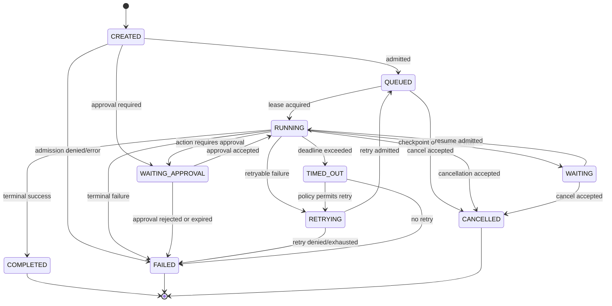
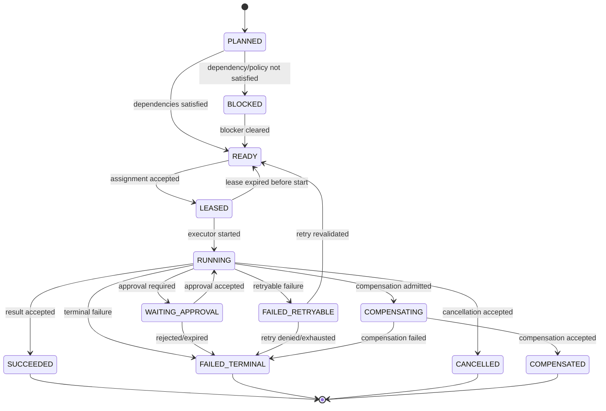

# REQ-03 Run/Task State Machine and Event Model

## 1. State ownership

ACS owns logical Run and Task state. Executors and providers report observed
execution state. A reported state is accepted only through an ACS transition
with policy, lease, fencing, idempotency, and causation checks.

## 2. Run lifecycle



`UNKNOWN` is an observed/reconciliation state, not a successful terminal
state. It is used when ACS cannot prove the external outcome. It requires
reconciliation before retry, resume, or cost finalization.

## 3. Task lifecycle



## 4. Transition rules

| Transition | Required evidence and guard |
|---|---|
| `CREATED -> QUEUED` | Admission decision, immutable binding, policy snapshot, idempotency record. |
| `QUEUED -> RUNNING` | Valid lease, current fencing token, eligible worker/target, dispatch event. |
| `RUNNING -> WAITING` | Durable checkpoint or explicit external wait reference. |
| `RUNNING -> WAITING_APPROVAL` | Approval requirement and request persisted before dispatch pauses. |
| `RUNNING -> RETRYING` | Normalized failure, retry policy, remaining deadline/budget, and no unresolved unknown outcome. |
| `RUNNING -> COMPLETED` | Terminal result, output/artifact refs, usage observation, evidence append. |
| `RUNNING -> FAILED` | Terminal failure and safe error classification. |
| `RUNNING -> CANCELLED` | Cancellation authority, executor observation, and finalization evidence. |
| `RUNNING -> TIMED_OUT` | ACS deadline event; executor may later report a reconciled outcome. |
| `WAITING -> RUNNING` | Named checkpoint, revalidated policy/binding, new admission event. |
| `WAITING_APPROVAL -> RUNNING` | Valid ApprovalDecision and unexpired authority. |
| `READY -> LEASED` | Durable assignment, lease expiry, fencing token, idempotent dispatch key. |
| `LEASED -> RUNNING` | Worker start acknowledgement correlated to assignment. |
| `FAILED_RETRYABLE -> READY` | New attempt number and revalidated budget, authority, evidence, and binding. |
| `COMPENSATING -> COMPENSATED` | Separate compensation authority, cost, evidence, and result. |

No transition mutates an immutable revision, prior attempt, prior event, or
historical evidence record.

## 5. Lease, fencing, recovery and idempotency invariants

- A lease is scoped to an assignment and expires independently of process state.
- A fencing token is checked by the durable state owner before accepting a
  worker mutation.
- A repeated request with the same idempotency key and request hash returns the
  original logical operation; a different hash is a conflict.
- Delivery retransmission may repeat transport but cannot create a second
  accepted attempt for the same dispatch key.
- Exactly-once external effects are not assumed. Unknown outcomes require
  reconciliation or an explicit operator/governance decision.
- Recovery resumes from an ACS checkpoint and preserves prior attempts as
  evidence and usage inputs.
- The existing durable runtime mechanism is extended in place. A second queue
  or parallel lease authority is prohibited by this contract.

## 6. Event envelope

```yaml
EventEnvelope:
  event_id: string
  event_type: string
  schema_version: string
  timestamp: timestamp
  sequence: integer
  organization_id: string
  product_domain: string
  tenant_id: string?
  run_id: string?
  task_id: string?
  attempt: integer?
  agent_id: string?
  workforce_id: string?
  workflow_id: string?
  actor:
    kind: system | human | service | executor | provider | planner | tool
    ref: string?
  source: acs | executor | provider | planner | tool | product | human
  correlation_id: string
  causation_id: string?
  idempotency_key: string?
  payload: object
```

Events are immutable. Sequence is monotonic within the ACS event stream scope;
`event_id` is globally unique. Consumers use `(stream_scope, sequence)` or a
cursor for ordering and `event_id` for deduplication.

## 7. Event classes

| Class | Event types |
|---|---|
| Lifecycle | `run.created`, `run.queued`, `run.started`, `run.waiting`, `run.completed`, `run.failed`, `run.cancelled`, `run.timed_out` |
| Task/execution | `task.ready`, `task.leased`, `task.started`, `task.succeeded`, `task.failed`, `execution.submitted`, `execution.observed`, `execution.reconciled` |
| Tool/provider | `tool.requested`, `tool.completed`, `provider.observed`, `model.selected`, `binding.admitted` |
| Evidence/artifact | `evidence.appended`, `evidence.corrected`, `artifact.created`, `artifact.linked` |
| Approval/governance | `policy.evaluated`, `approval.requested`, `approval.decided`, `governance.denied` |
| Usage/cost | `usage.recorded`, `usage.corrected`, `cost.calculated`, `cost.disputed` |
| Retry/recovery | `retry.requested`, `retry.admitted`, `checkpoint.created`, `run.resumed`, `lease.expired`, `fencing.rejected` |
| Error | `validation.failed`, `executor.failed`, `provider.failed`, `reconciliation.required` |

Event payloads must contain typed references and safe details. Secrets, raw
credentials, unredacted provider prompts, and unrestricted tool outputs are
excluded or stored behind controlled ArtifactReferences.

## 8. Event storage and outbox invariant

The ACS fact and its event/outbox record are committed before an external
dispatch, notification, or webhook is attempted. External delivery status is a
correlated observation. Failed external delivery does not erase the canonical
ACS event; it creates retry or delivery evidence.

## 9. Recovery contract

A checkpoint contains at least:

```yaml
Checkpoint:
  checkpoint_id: string
  run_id: string
  task_id: string?
  workflow_revision_ref: RevisionRef?
  graph_fingerprint: sha256?
  attempt: integer
  assignment_ref: EntityRef?
  lease_ref: EntityRef?
  fencing_token: string?
  executor_handle_ref: EntityRef?
  policy_snapshot_refs: [PolicySnapshotRef]
  pending_approval_refs: [EntityRef]
  artifact_refs: [EntityRef]
  evidence_gap_refs: [EntityRef]
  created_at: timestamp
```

Resumption creates a new admission and event chain linked by causation and
correlation IDs. It does not rewrite the checkpoint or previous attempt.

