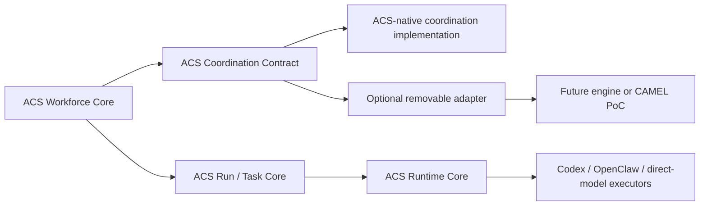

# Coordination Adapter Sovereignty Boundary

## Contract

The adapter boundary is proposal-and-observation based. An adapter can receive
immutable execution input and return a proposal or normalized observation. It
MUST NOT hold write access to canonical Workforce, Agent, Run, Task, Evidence,
Cost, Governance, or runtime-assignment stores.

## Mandatory adapter rules

1. ACS MUST create identities, revisions, Run membership snapshots, Task
   records, attempts, events, and evidence before an adapter can reference them.
2. Adapter output MUST be untrusted input and carry source, correlation,
   causation, and completeness metadata.
3. An adapter MUST NOT select a new Agent revision, Workforce member, provider,
   executor, credential, budget, approval, or authority outside an ACS-approved
   plan.
4. An adapter MUST NOT own a queue, retry ledger, checkpoint authority, Task
   completion authority, cost ledger, or canonical persistence.
5. Adapter removal MUST leave canonical definitions, historical Run
   reconstruction, evidence, and cost aggregation operational.
6. CAMEL-specific channels, worker pools, snapshots, callbacks, and object IDs
   MUST NOT appear in the generic ACS contract.

## Optional future adapter admission

A future adapter requires separate implementation authorization, source/license
review, contract tests, failure injection, export/removal proof, and evidence
that it compiles execution to the existing ACS lease/fencing substrate. CAMEL
remains a removable PoC candidate only.

