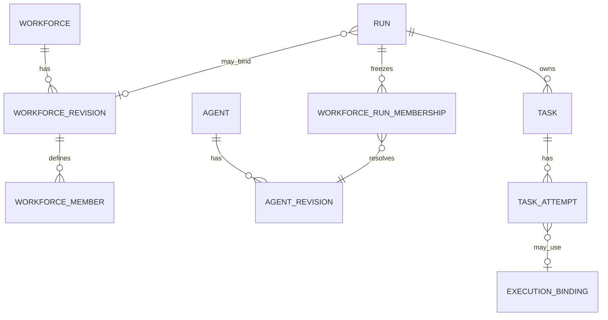

# Workforce ↔ Run ↔ Task Ownership

## Cardinality and ownership

| Concept | Canonical owner | Relationship |
| --- | --- | --- |
| Workforce / revision / member slot | Workforce Core | Definition exists independently of execution. |
| Workflow graph and coordination policy | Workflow/Coordination | May target Workforce slots; does not alter roster identity. |
| Run | Run Core | MAY bind one Workforce revision. A Run without Workforce is valid for single-Agent or system work. |
| Workforce run membership | Run admission | Resolves every member slot to one Agent revision. |
| Task | Run/Task Core | Belongs to exactly one Run and represents logical work. |
| Task assignment decision | Coordination | Selects an eligible admitted member slot for one Task. |
| Task attempt | Run/Task Core plus Runtime | Represents one admitted execution attempt. |
| Worker / executor | Runtime / Executor | Executes an assignment only; never becomes a Workforce member. |

## Frozen Run behavior

- A Workforce Run MUST reference one WorkforceRevisionRef.
- A new operational Workforce Run MUST bind the active current Workforce
  revision in its admission transaction. A non-current historical revision MAY
  be used only by a separately authorized replay or reconstruction operation;
  it MUST carry its explicit authority/evidence reference and MUST NOT advance
  the Workforce head or bypass the current lifecycle state for a new
  operational admission.
- A Run MAY exist without a Workforce; no Workforce membership snapshot is then
  created.
- A Task MAY be assigned only to an eligible member slot in the Run snapshot,
  except system or approval nodes expressly defined by Workflow.
- Assignment MAY change only through a new canonical coordination decision and
  Task reassignment event. It MUST NOT mutate the original decision or previous
  attempt.
- Run/Task Core owns Task state. Runtime owns lease and executor lifecycle.
  Executor reports observations; its state is not canonical until ACS validates
  and commits it.

## Failure and recovery

Workforce Core does not fail or recover work. If a member Agent becomes
unavailable, Coordination decides whether a task is blocked, reassigned to an
eligible admitted slot, retried, escalated, or terminated. Runtime detects
worker/executor failure, lease expiry, timeout, and stale ownership. Run/Task
Core admits retries only after policy, budget, approval, binding, idempotency,
and recovery checks pass. The failed Attempt remains canonical and receives an
authorized terminal or unknown status; recovery creates a new Attempt and, if
the member slot changes, a new assignment decision. A replacement Agent
revision or member outside the Run snapshot requires a governed Run-membership
amendment contract that is deferred beyond Workforce v1; until separately
frozen and implemented, such substitution MUST be rejected rather than silently
performed.
