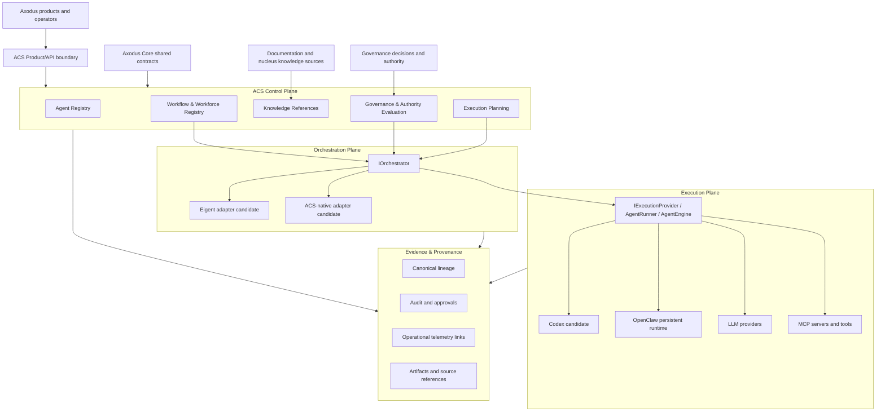

# ACS v2 Target Architecture

**Status:** `PROPOSED / NOT IMPLEMENTED AS A WHOLE`

## Architectural thesis

ACS v2 is the governed agent coordination layer that preserves Axodus agent
identity, workflow intent, authority references, institutional evidence, and
provider independence while delegating bounded capabilities to execution and
orchestration providers.

“ACS sovereignty” is bounded: ACS is sovereign over its domain records and
adapters, but it is not sovereign over constitutional governance, product
business truth, institutional knowledge, treasury, or execution authority.

## Proposed planes



## Ownership matrix

| Concern | Canonical owner | Delegation allowed | Must not happen |
| --- | --- | --- | --- |
| Agent identity and revision | ACS | Operational projection to Agenta/providers | Provider-generated identity becoming canonical without ACS adoption. |
| Workforce/workflow definition | ACS | Execution projection to Eigent/CAMEL or another engine | Provider UI/state becoming the only workflow source. |
| Constitutional and policy authority | Governance and authorized product owners | ACS evaluation/enforcement under explicit references | ACS or a provider self-authorizing. |
| Shared protocol semantics | Core | Typed consumption by ACS and products | Runtime or policy implementation inside Core. |
| Institutional/domain knowledge | Documentation and owning nucleus | Scoped ACS knowledge references and snapshots | Copying uncontrolled knowledge into provider memory as canonical truth. |
| Execution planning | ACS | Provider capability discovery | A provider selecting authority, credentials, or budget outside the plan. |
| Temporary orchestration state | Selected orchestrator | ACS retains identifiers, checkpoints, and final lineage | Loss of institutional history when a provider is removed. |
| Runtime materialization | OpenClaw or another execution target | Replaceable engine/runner | Runtime files defining the canonical agent. |
| Evidence and provenance | ACS, using Core-compatible receipts/references | Ingest provider telemetry and artifacts | External tracing being the only institutional audit record. |

## Control plane

The control plane answers:

- Which Organization and product domain is requesting work?
- Which governed agent revision is eligible?
- Which workforce/workflow revision is requested?
- Which knowledge references and snapshots are allowed?
- Which authority, policy, capability, budget, and approval references apply?
- Which orchestrator, runner, engine, model, tools, and target are eligible?
- Which evidence must be produced before the run can close?

Planning does not authorize execution. The effective execution plan must be
immutable for a run attempt and must reference exact revisions and policies.

## Agent-management plane

Agent management is an ACS capability even if Agenta is selected as an
operational workspace.

ACS must preserve at minimum:

- stable agent ID and domain/Organization ownership;
- immutable revisions and fingerprints;
- role, profile, instructions, skills, tools, models, and runner preferences;
- knowledge scope and prohibited context;
- permission and policy references;
- lifecycle state and supersession;
- validation/evaluation references;
- provider projection identifiers without adopting them as canonical IDs.

## Orchestration plane

The orchestration plane operates through an ACS-owned `IOrchestrator`-like
contract. Eigent/CAMEL, an ACS-native orchestrator, or another provider can
implement that contract.

The contract must support:

- deterministic workflow/workforce revision input;
- task dependencies, parallel branches, joins, and handoffs;
- task leases, idempotency, retries, cancellation, and timeouts;
- temporary state checkpoints;
- human interruption and approval states;
- typed context passing with domain and data classifications;
- partial failure and compensation outcomes;
- provider-neutral events sufficient to reconstruct the run;
- no implicit ability to change canonical agent or workflow definitions.

## Execution plane

The execution plane reuses and evolves the existing separation between
`AgentEngine`, `AgentRunner`, model providers, credentials, and execution
targets.

- **Codex:** candidate cognitive/engineering runner for repository analysis,
  code, tests, architecture, and technical documentation. It does not become an
  ACS agent identity.
- **OpenClaw:** candidate persistent operational runtime for scheduled and
  event-driven work where current adapter evidence supports it.
- **Models:** inference providers selected by an authorized execution plan.
- **MCP/tools:** individual capabilities with explicit permission and evidence
  requirements.

## Knowledge boundary

ACS Knowledge is a governed consumption and context-assembly capability, not a
replacement for the institutional knowledge base.

Each run should reference:

- source owner;
- canonical URI or repository path;
- content revision/hash;
- retrieval timestamp;
- classification and access scope;
- Organization/product domain;
- validity or review state;
- derived context artifact and redaction policy.

Cross-domain context is denied by default. A shared agent receives only the
explicitly approved slice for the current task and does not retain unrelated
domain context after the run unless a governed retention rule exists.

## Evidence plane

Evidence is transversal and must correlate the entire chain:

```text
request
  -> authority and approval
  -> workflow/workforce revision
  -> task and parent task
  -> agent revision
  -> knowledge/source references
  -> orchestration provider and revision
  -> execution provider/model/tools
  -> outputs and artifacts
  -> validation/review
  -> decision and next task
  -> retry/failure/finality
```

Provider traces may be linked or ingested. They do not replace the ACS record.
Sensitive inputs, model prompts, tool results, and artifacts require explicit
classification, redaction, and retention handling.

## Trust boundaries

| Boundary | Primary risks | Required posture |
| --- | --- | --- |
| Product -> ACS | actor spoofing, malformed scope, cross-Organization access | authenticated actor, explicit Organization/domain, validation, rate limits. |
| ACS -> Governance/Core | stale authority, semantic mismatch | versioned references, fail closed, compatibility checks. |
| ACS -> Agenta | canonical drift, secret duplication, enterprise-license assumptions | projection adapter, exact edition/version, no secret values, export/recovery test. |
| ACS -> Eigent/CAMEL | workflow lock-in, context leakage, nondeterministic replay | ACS workflow revision, typed adapter, isolation, checkpoint/evidence contract. |
| ACS -> Codex/OpenClaw | filesystem/network overreach, prompt injection, provider identity confusion | sandbox, allowlists, scoped roots/tools, immutable plan, audit. |
| Runtime -> evidence | tampering, missing events, excessive sensitive payload | signed/correlated events where appropriate, redaction, completeness validation. |

## Provider-removal test

The architecture fails the provider-independence requirement if removing
Agenta, Eigent, Codex, or OpenClaw causes the loss of any of the following:

- canonical agent IDs and revisions;
- canonical workflow/workforce definitions;
- governance and approval references;
- knowledge provenance;
- institutional execution history;
- the ability to project the same approved definition to another provider.

## Human authority

Human approval is a typed workflow state, not an informal pause. It must record
the reviewer, mandate, decision, scope, timestamp, evidence considered, and any
conditions. A provider may request or display approval, but cannot fabricate or
implicitly satisfy it.
