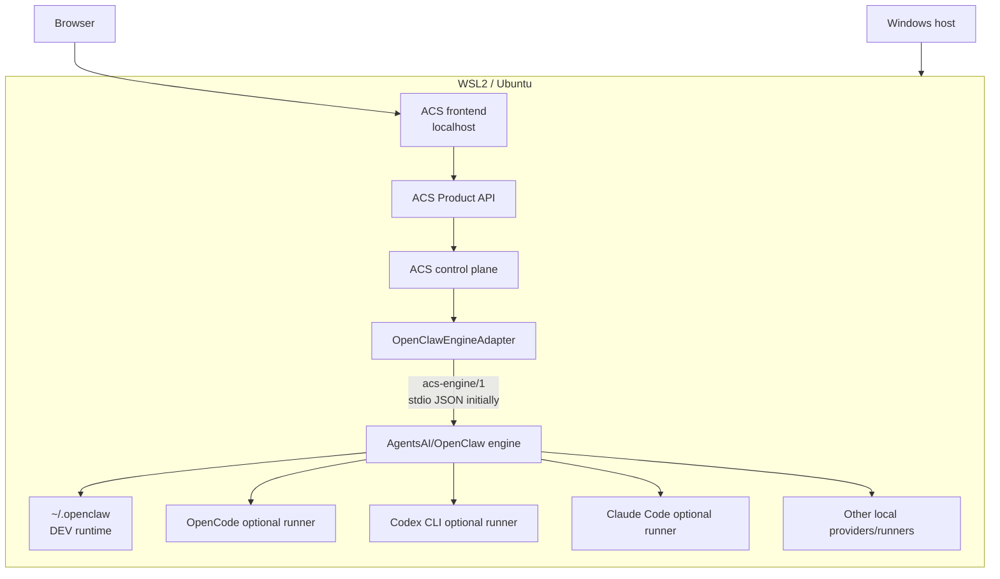
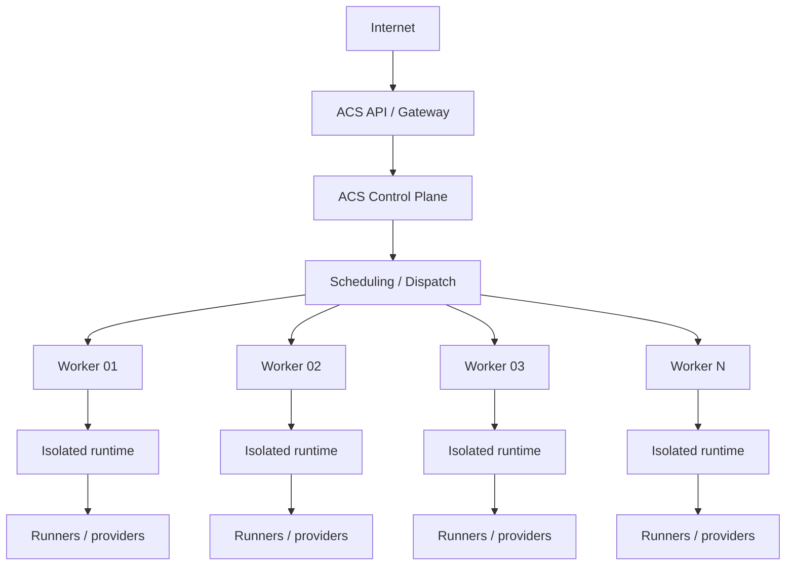
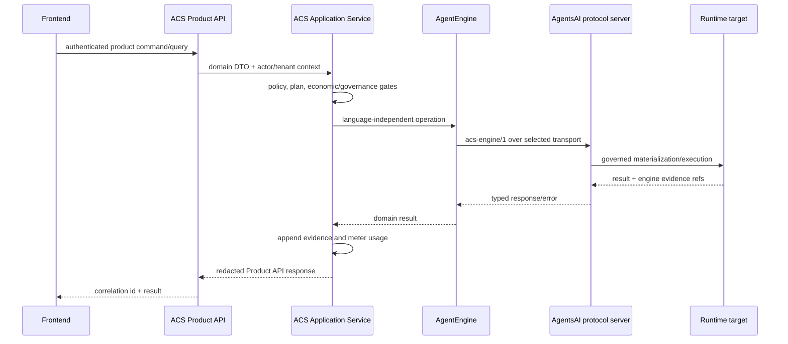
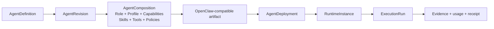
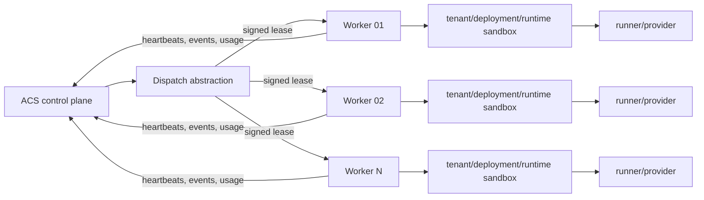
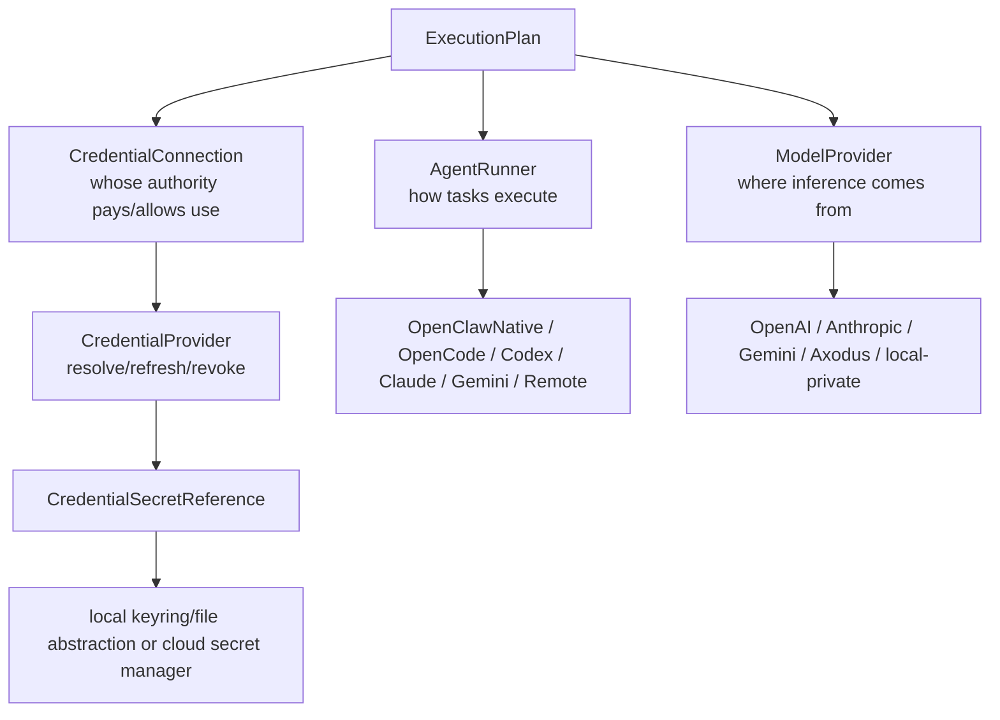

# EPIC-10 Architecture

## 1. System boundary

```text
ACS = Control Plane + Governance + Product API + Identity/Access
    + Billing/Metering + Audit/Evidence

AgentsAI/OpenClaw = Autonomous Agent Execution Engine

Execution Runtime = External, mutable, environment-specific runtime state
```

ACS owns intent, authority, revisions, scheduling decisions, economic decisions, and evidence indexes. AgentsAI owns deterministic composition and execution-engine behavior. A runtime owns only the materialized files, processes, memory, state, and workspaces required to execute an approved deployment.

## 2. Environment topologies

### 2.1 DEV-LOCAL



DEV-LOCAL MUST be fully usable for integration and testing. Its normative path is Browser → localhost frontend → ACS Product API → engine adapter → AgentsAI/OpenClaw → configured runtime. Subprocesses MUST receive an explicit root configuration and sanitized environment. The temporary legacy source/runtime overlap is not an acceptable S01 completion state.

### 2.2 PROD-CLOUD



Production MUST NOT assume shared processes, filesystems, VMs, hosts, or trust zones between control plane and engine. A worker is a replaceable execution target, not a domain aggregate.

## 3. Root and dependency model

Every engine process MUST receive an immutable `EngineEnvironment` containing absolute, normalized roots:

| Root | Ownership and allowed content |
|---|---|
| `source_root` | Read-only versioned AgentsAI engine source/package. |
| `runtime_root` | Engine-native materialization and runtime files for the target/tenant. |
| `state_root` | Engine/operator state and registries; not source. |
| `config_root` | Non-secret configuration and environment overlays. Secret values remain references. |
| `artifacts_root` | Candidates, compositions, deployment packages, logs subject to retention, and evidence payloads. |
| `workspace_root` | Per-run working data made available to untrusted execution. |

The loader MUST reject relative paths, unsafe symlink escapes, roots outside an execution target allowlist, and unsafe overlap. DEV MAY explicitly waive selected overlaps only through a test-only policy with a visible warning; production MUST reject source/runtime/state overlap. Source MUST be mounted read-only in production.

Recommended source integration:

```text
ACS/
├── src/
├── static/
├── docs/
└── engines/
    └── agentsai/  # pinned engine source dependency
```

Use a Git submodule for the first integration because it preserves independent repository history/revision, provides a reviewable pin, and fits the current source repository. Costs are submodule initialization, coordinated CI checkout, and developer tooling complexity. A published wheel/container is preferable once AgentsAI has an independent release pipeline and versioned artifacts. A subtree or copied source is NOT recommended because it obscures provenance and encourages drift. Whichever mechanism is chosen MUST expose the exact commit/digest independently of runtime state.

Engine dependency source MUST NOT contain or commit `.env`, credentials, secret-bearing `openclaw.json`, runtime SQLite databases, logs, `.acs/state`, agent runtime state, or temporary workspaces.

## 4. Control-plane to engine



Direct Node/Python imports and FFI are prohibited. `OpenClawEngineAdapter` is one `AgentEngine`; `RemoteAgentEngine` and `CustomAgentEngine` MUST fit without changing the ACS agent domain.

## 5. Unified agent lifecycle



- `AgentDefinition` is the stable governed identity and intent container.
- `AgentRevision` is an immutable snapshot with fingerprint and resource revision references.
- `AgentComposition` is a deterministic resolution report and materializable artifact set.
- `AgentDeployment` binds one revision/composition to one target and mode.
- `RuntimeInstance` is the observed lifecycle of a deployed materialization.
- `ExecutionRun` is one planned, authorized, metered attempt.

`openclaw.json`, generated profiles, runtime directories, PIDs, and logs MUST NOT be the ACS top-level domain model. They are materializations or observations and MAY be rebuilt from a governed revision plus approved environment inputs.

Role and Profile remain reusable governed objects. Their new revisions MUST NOT silently propagate into existing AgentRevisions. Explicit adoption creates a new AgentRevision and invalidates stale validation/deployment evidence. Existing AgentsAI revision/fingerprint/change-set semantics SHOULD be retained.

## 6. Execution planning and dispatch

Before execution ACS MUST persist an immutable `ExecutionPlan` resolving agent revision, environment, engine and revision, execution target, runner, provider/model strategy, credential references, governance policy/version, economic policy/version, isolation mode, limits, and correlation identifiers. Planning does not authorize execution.



Dispatch MUST be at-least-once safe through idempotency keys and leases. A worker MUST authenticate, advertise capabilities/capacity, accept only eligible plans, enforce local limits, redact evidence, and fail closed when authority expires. The scheduler MUST not infer support merely from a worker being online.

## 7. Provider, runner, and credential separation



One adapter MAY advertise multiple roles through capability discovery, but its registrations remain separate. OpenCode MAY be a local runner, cloud-worker runner, provider gateway, or all three when discovered capabilities prove support. It MUST be optional and reached through localhost, private network, or authenticated internal service; it MUST NOT be a public production dependency.

Consumption modes are:

- Axodus Managed: ACS selects an Axodus gateway connection and Axodus bears upstream inference responsibility.
- BYOK: user credential reference selects an API provider; user bears upstream provider cost.
- BYOS: official account/subscription authorization selects a runner/gateway entitlement; no unsupported session copying/scraping is allowed.
- Local/user-controlled: target-local or private inference such as Ollama or enterprise endpoints.

## 8. Governance and deployment modes

```text
Definition → Validation → Composition → Candidate → Safety approval
→ Operational preflight → ExecutionPlan → Economic authorization
→ Governance authorization → Deployment → Runtime execution
→ Inspection → Evidence → Settlement
```

Modes are `sandbox`, `staged`, and `live`:

- `sandbox`: isolated, deny-by-default, non-production, synthetic/safe integrations; initial mode.
- `staged`: production-like isolation and credentials with external impact blocked or explicitly constrained.
- `live`: approved external impact under production controls.

Live MUST NOT be introduced until root boundaries, engine contract, safety/governance gates, execution targets, economic interfaces, evidence, and isolation expectations are stable and independently tested. Existing sandbox restrictions MUST remain intact until then.

## 9. Runtime isolation

The isolation key is at least `(tenant_id, deployment_id, runtime_instance_id)`. Each instance receives a dedicated workspace, credential projection, memory/state scope, sandbox, limits, and network policy. Mechanisms MAY be process, container, dedicated worker, VM, or another evaluated sandbox. Kubernetes is neither required nor prohibited.

Isolation tier and worker trust class MUST be explicit target capabilities. A single shared trusted `~/.openclaw` is DEV-only and MUST NOT host untrusted multi-tenant production workloads.

## 10. Architectural decisions

| ADR | Decision | Consequence |
|---|---|---|
| ADR-01 | ACS is control plane; AgentsAI/OpenClaw is execution engine. | Authority and engine implementation evolve independently. |
| ADR-02 | OpenClaw source and runtime state are separate. | Runtime is configurable, mutable, and excluded from source dependency. |
| ADR-03 | DEV co-location is not a production requirement. | All contracts support remote components. |
| ADR-04 | ACS ↔ AgentsAI uses a language-independent protocol. | No imports/FFI across TypeScript/Python. |
| ADR-05 | Protocol is transport independent. | stdio can become socket/HTTP/gRPC/bus without domain redesign. |
| ADR-06 | Frontend communicates only with Product API. | Secrets and engine internals remain server-side. |
| ADR-07 | Definitions and runtime instances are different entities. | Reproducible intent and observable state are not conflated. |
| ADR-08 | Model providers and agent runners differ. | CLI/gateway/provider combinations remain composable. |
| ADR-09 | BYOK and account-backed access are distinct modes. | Security, entitlement, refresh, and billing are provider-specific. |
| ADR-10 | OpenCode is optional infrastructure. | Capability discovery selects it; engine does not require it. |
| ADR-11 | `$Neurons` is an ACS economic domain. | Quote/reserve/meter/settle are designed before live paid execution. |
| ADR-12 | Execution is sandbox-first and governance-gated. | No local integration shortcut enables live execution. |
| ADR-13 | Production runtimes support tenant/workload isolation. | Shared `~/.openclaw` is disallowed for production tenancy. |
| ADR-14 | Remote/distributed workers are mandatory architectural capability. | Control plane does not depend on local filesystem/process. |
| ADR-15 | AgentRevision is the governed source of executable truth. | Runtime files are replaceable materializations. |
| ADR-16 | ExecutionPlan is persisted before authorization/execution. | Intent can be reproduced, audited, and priced. |
| ADR-17 | Economic and governance authorizations are independent. | Funding never grants permissions; permissions never grant funding. |
| ADR-18 | Engine dependency is independently versioned; submodule first. | Provenance is exact while future packaging remains possible. |
| ADR-19 | Evidence is append-oriented and secret-free. | Audits remain correlatable without credential disclosure. |
| ADR-20 | Deployment orchestration is infrastructure-neutral. | No premature Kubernetes/vendor dependency. |
