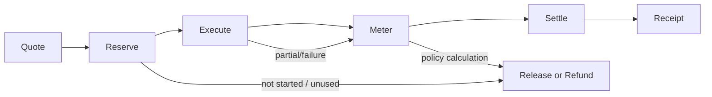

# EPIC-10 ACS Economic Layer

## 1. Domain boundary

`$Neurons` is part of the ACS economic domain, not a late payment plugin. This specification defines abstract economic contracts and uses settlement asset code `NEURONS`; it does not define token mechanics, chain, custody, exchange rate, price, or final accounting infrastructure.

The following decisions are independent:

- Authentication: who is acting?
- Authorization: may the actor request the action?
- Entitlement: which service/model/runner may the account use?
- Metering: what resources were consumed?
- Billing: what amount/responsibility follows from policy and usage?
- Settlement: how is an authorized amount finalized in `$Neurons` or a future connector?

Economic authorization MUST NOT grant governance/tool permission. Governance authorization MUST NOT imply funding.

## 2. Lifecycle



1. `Quote` estimates charge components, payer responsibility, constraints, policy revision, expiry, and uncertainty from an immutable ExecutionPlan.
2. `Reserve` pre-authorizes a maximum amount/entitlement and returns a reservation with expiry/idempotency. If known required funding/entitlement is insufficient, paid execution MUST NOT start.
3. `Execute` starts only after required economic and governance authorizations. The run carries reservation/policy IDs but no economic secret.
4. `Meter` appends signed/attributable usage records per dimension and attempt. Failure/cancellation may still have billable usage.
5. `Settle` applies billing policy to accepted usage within reservation bounds and creates an idempotent settlement instruction/result.
6. `Receipt` correlates quote, reservation, plan/run, usage, pricing/policy revisions, charged/released amounts, payer responsibilities, and settlement status.
7. Unused reservation MUST be releasable/refundable under the final policy. Expiry and partial-settlement behavior MUST be explicit before live use.

## 3. Core contracts

```ts
interface EconomicService {
  quote(plan: ExecutionPlan): Promise<EconomicQuote>;
  reserve(quoteId: string, idempotencyKey: string): Promise<EconomicReservation>;
  authorize(reservationId: string, planFingerprint: string): Promise<EconomicAuthorization>;
  recordUsage(record: UsageRecord): Promise<void>;
  settle(runId: string, idempotencyKey: string): Promise<SettlementResult>;
  release(reservationId: string, reason: string): Promise<ReleaseResult>;
  receipt(runId: string): Promise<EconomicReceipt>;
}
```

`EconomicQuote` MUST identify charge components without embedding final pricing rules in agents. `EconomicReservation` MUST identify reserved amount/unit/asset, expiry, owner/payer, plan fingerprint, and status. `EconomicAuthorization` is short-lived and plan/reservation-bound. `UsageRecord` is append-only, dimensioned, timed, source-attributed, deduplicated, and linked to run/attempt/target/provider/runner. `SettlementResult` is idempotent and distinguishes `pending`, `settled`, `partially_settled`, `failed`, and `released`.

## 4. Metering dimensions

Independent meters MUST be possible for LLM inference, agent runtime duration, compute, memory, storage, tools, network, premium capabilities, scheduled executions, autonomous duration, and future ACS services. A record includes quantity, unit, start/end or observation time, source, confidence/finality, tenant, run/attempt, and billable-responsibility classification.

Inference SHOULD distinguish input/output/cache/reasoning usage when the provider reports it, but provider-specific fields remain extensions. Runtime/compute meter sources MUST be target-authenticated. Estimated usage and final usage MUST be distinguishable.

## 5. Responsibility modes

| Mode | Upstream inference responsibility | Potential `$Neurons` coverage |
|---|---|---|
| Axodus Managed LLM | Axodus | ACS service, runtime, orchestration, inference, tools/storage/etc. |
| BYOK | User pays provider directly | ACS service, runtime, orchestration, compute, memory, tools/storage/etc.; no assumed Axodus inference charge. |
| BYOS | User subscription/account supplies model/runner entitlement | ACS service, runtime, orchestration, compute, memory, tools/storage/etc.; no assumed Axodus inference charge. |
| Local/private | User/enterprise owns inference infrastructure unless contracted otherwise | ACS services and any Axodus-operated runtime/resources. |

A single run may fall back from user-funded to Axodus-managed inference. The plan/quote MUST state whether that fallback is allowed and its maximum economic effect; activation of fallback MUST emit evidence and update responsibility records.

## 6. Axodus Managed model gateway

The gateway MUST support policy routing, quota, fallback, rate limiting, cost controls, usage attribution, provider abstraction, and future Axodus models. Tenants receive model capabilities and economic terms, never upstream credentials. Provider-reported usage MUST be reconciled with gateway/worker meters; discrepancies are visible rather than silently overwritten.

## 7. Failure and consistency rules

- Quote/reserve/settle/release are idempotent and auditable.
- A reservation race or expired authorization fails before start.
- Dispatch uncertainty MUST NOT create duplicate reservations or settlements.
- Usage may arrive after a run terminal event; receipts expose provisional/final status.
- Provider/worker meter disagreement creates a reconciliation case.
- Settlement failure MUST NOT rewrite execution evidence; it creates economic failure evidence and controlled retry/manual review.
- Economic service outage blocks paid starts when authorization is required, but does not prevent safety stop/cancellation.
- No price, token balance, or settlement finality claim is made without the authoritative economic connector response.

## 8. Evidence events

At minimum: `billing.quoted`, `billing.reserved`, `execution.economically_authorized`, `usage.metered`, `billing.settlement_requested`, `billing.settled`, `billing.refunded`, `billing.released`, `billing.reconciliation_required`, and `billing.failed`. Events MUST omit payment/credential secrets and correlate actor, tenant, plan/run, provider/runner/target, policy/pricing revision, and economic record IDs.
