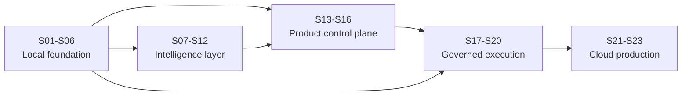

# EPIC-10 Story Specifications

Each story is an independently reviewable requirement unit. “Tests” are required evidence, not optional suggestions. Definition of Done (DoD) includes accepted contracts/ADRs, passing required tests, updated documentation, no unrelated diff, and one scoped local commit when implementation begins.

## Milestone A — Local Integration Foundation

### S01 Runtime & Environment Boundaries

- **Goal:** make source/runtime/state/config/artifacts/workspace ownership explicit and remove repository-relative runtime inference.
- **Scope:** `EngineEnvironment`, configuration precedence (arguments → environment-specific config → safe defaults), absolute root validation, overlap/symlink policy, WSL path guidance, and dependency injection through AgentsAI adapters/services.
- **Out of scope:** engine vendoring, protocol, live deployment, moving current operational runtime automatically.
- **Impact/repos:** foundational refactor in AgentsAI; ACS receives matching configuration DTO/documentation.
- **Dependencies:** none; blocks S02–S05, S17, S21–S23.
- **Contracts:** six-root `EngineEnvironment`, validation report, redacted effective-configuration inspection.
- **Migration:** legacy `~/.openclaw` overlap is detected and documented; no automatic writes/moves. Preserve existing state and `openclaw.json` byte-for-byte.
- **Acceptance:** no production code derives runtime/state/config/artifact/workspace paths from `Path(__file__)` or CWD; independent temporary roots work; unsafe overlaps/escapes fail closed; DEV mapping is explicit.
- **Tests:** unit matrix for precedence/normalization/overlap/symlinks/missing roots; integration from non-repo CWD; regression hash proving real `openclaw.json` unchanged.
- **DoD:** configuration contract and migration/operator guide accepted; existing sandbox suite passes; no runtime mutation.
- **Risks:** hidden legacy imports/constants and WSL symlink/case behavior. Mitigate with compatibility adapter plus deprecation telemetry.

### S02 Local WSL2 Execution Target

- **Goal:** represent the first usable `local-wsl` target without making locality a domain assumption.
- **Scope:** target descriptor, health/capability/capacity probes, explicit runtime/root mapping, scheduling eligibility, optional runner discovery, diagnostics.
- **Out of scope:** cloud dispatch, live target, production hardening, automatic credential import.
- **Impact/repos:** ACS target registry/application/API; AgentsAI health/discovery operations.
- **Dependencies:** S01; informs S04/S06.
- **Contracts:** `ExecutionTarget(type=local)`, health freshness, runner/provider/isolation capabilities.
- **Migration:** convert `ACS_OPENCLAW_AGENTS_ROOT` behavior into a compatibility mapping; avoid changing `~/.openclaw`.
- **Acceptance:** healthy local target can be discovered deterministically from any CWD; missing engine/runtime is degraded with actionable redacted reasons; local integration path is testable.
- **Tests:** WSL/root fixtures, stale health, unavailable runner, capacity, path-with-spaces/symlink, no-write health checks.
- **DoD:** target appears through Product API fixture and is eligible only when all required probes pass.
- **Risks:** Windows-mounted filesystem performance and host-specific paths; document Linux-filesystem preference and benchmark separately.

### S03 AgentsAI Engine Packaging / Submodule

- **Goal:** identify AgentsAI source revision independently and reproducibly from runtime state.
- **Scope:** evaluate and record submodule vs wheel/container; implement a pinned dependency workflow later; CI/developer bootstrap contract; source exclusions and provenance.
- **Out of scope:** copying runtime, broad Python namespace rename, release automation beyond the chosen minimum.
- **Impact/repos:** ACS dependency metadata/CI/docs; AgentsAI packaging metadata if required.
- **Dependencies:** S01; baseline commit `44e9f4d...`.
- **Contracts:** engine dependency descriptor with repository, commit/digest, package/protocol versions, dirty-state policy.
- **Migration:** never submodule `~/.openclaw`; use a clean AgentsAI source checkout. Ignore/prohibit runtime content.
- **Acceptance:** clean checkout resolves exact engine revision; CI initializes/verifies it; dirty/unpinned dependency fails verification; source contains no prohibited runtime state.
- **Tests:** bootstrap from fresh clone, revision mismatch, missing dependency, prohibited-file scan, packaging smoke.
- **DoD:** ADR confirms mechanism; recommendation is submodule initially, with documented future package/container exit path.
- **Risks:** submodule ergonomics, Windows executable bits/EOL, and accidental source/runtime target confusion.

### S04 ACS ↔ Engine Protocol

- **Goal:** establish stable `acs-engine/1` independently of stdio.
- **Scope:** JSON Schemas/envelopes, version negotiation, operations, errors, correlation, deadlines, idempotency, cancellation, health/version/capability discovery, stdio reference transport.
- **Out of scope:** remote production transport, domain UI, direct FFI.
- **Impact/repos:** shared normative schemas in ACS; TypeScript client and Python protocol server implementations in their repos.
- **Dependencies:** S01, S03; enables S05/S17/S18/S21.
- **Contracts:** all protocol requirements in `contracts.md`; schema compatibility policy and conformance fixtures.
- **Migration:** wrap `ACSApplicationService`; retain CLI as peer client, not protocol parser or source of truth.
- **Acceptance:** TS/Python pass identical golden frames; stdout contains protocol only; transport loss differs from domain error; cancellation/deadline/idempotency are demonstrable.
- **Tests:** schema/golden/unknown-field/version/error/redaction/concurrency/timeout/cancel/crash/partial-frame tests.
- **DoD:** protocol schemas and conformance suite versioned; compatibility matrix published.
- **Risks:** accidental leakage of Python shapes and stdout diagnostics corrupting framing.

### S05 OpenClaw Engine Adapter

- **Goal:** make AgentsAI/OpenClaw one implementation of ACS `AgentEngine`.
- **Scope:** DTO mapping, supervised process lifecycle, health/capability cache, error translation, deadlines/cancel, revision/evidence propagation.
- **Out of scope:** reimplementing Roles/Profile/Composition in TS, cloud transport, live start.
- **Impact/repos:** ACS adapter/process supervisor; AgentsAI protocol operations.
- **Dependencies:** S02–S04.
- **Contracts:** `AgentEngine`, `OpenClawEngineAdapter`, request/command contexts, engine domain mappings.
- **Migration:** existing `src/openclaw.ts` discovery becomes compatibility/read-only implementation until retired.
- **Acceptance:** ACS lists/inspects and runs sandbox-safe operations only through adapter; engine restart/failure yields stable errors; no internal filesystem parsing.
- **Tests:** contract tests with fake server plus real local engine smoke; crash/restart/stale revision/redaction/timeout.
- **DoD:** ACS core imports only interface/DTOs; engine revision visible in evidence/health.
- **Risks:** mismatched domain semantics and orphan subprocesses.

### S06 Execution Target Registry

- **Goal:** govern target identity, capabilities, health, capacity, and scheduling eligibility.
- **Scope:** registry CRUD/inspection, freshness, labels/constraints, trust/isolation modes, eligibility evaluator; `local`, `cloud-worker`, `remote` types.
- **Out of scope:** scheduler/dispatch implementation and auto-scaling.
- **Impact/repos:** ACS domain/application/API/evidence.
- **Dependencies:** S02, S04, S05.
- **Contracts:** `ExecutionTarget`, `TargetHealthObservation`, `TargetCapabilitySet`, eligibility decision/reasons.
- **Migration:** register `local-wsl`; no implicit singleton default in persisted plans.
- **Acceptance:** incompatible/stale/unhealthy/capacity-full targets cannot schedule; reasons are deterministic; target revisions are auditable.
- **Tests:** registry concurrency, health expiry, capability constraints, target removal with active deployments, tenant/location policy.
- **DoD:** query API and evidence events exist; local target fixture passes.
- **Risks:** trusting self-advertised capabilities and racey capacity; require verified identity and leases later.

## Milestone B — Intelligence Provider Layer

### S07 LLM Provider Contract

- **Goal:** model inference providers independently from runners and credentials.
- **Scope:** provider/model discovery, health, capabilities, estimates, availability, local/private extensions, model strategy and fallback compatibility.
- **Out of scope:** all provider implementations, final pricing, runner execution.
- **Impact/repos:** ACS domain/application/API; optional AgentsAI capability translation.
- **Dependencies:** S04/S06 capability patterns.
- **Contracts:** `ModelProvider`, `ModelDescriptor`, `ModelStrategy`, provider health/usage extensions.
- **Migration:** split current generic ProviderRegistry semantics with an explicit legacy adapter.
- **Acceptance:** OpenAI/Anthropic/Gemini/Axodus/local examples validate without assuming API keys; provider cannot execute agent tasks merely by registration.
- **Tests:** schema, capability filtering, unavailable primary/fallback, context/tool requirements, unknown model/provider.
- **DoD:** contract and fallback decision evidence accepted.
- **Risks:** rapidly changing model metadata and provider-specific leakage.

### S08 Credential & Account Connection Model

- **Goal:** securely represent managed, API-key, OAuth, subscription, local-runner, and service-account connections.
- **Scope:** connection lifecycle/status/ownership/scopes, opaque secret references, backend abstraction, official BYOS authorization rules, frontend redaction.
- **Out of scope:** unsupported session copying, every OAuth flow, production vault selection.
- **Impact/repos:** ACS identity/secrets/application/API/security; workers consume short-lived leases.
- **Dependencies:** S07; security baseline.
- **Contracts:** four credential concepts in `contracts.md`, purpose-limited lease, validate/refresh/revoke.
- **Migration:** adapt existing `AcsSecretStorage`/mock references; never expose legacy raw values.
- **Acceptance:** secrets never round-trip from API; tenant ownership enforced; expired/revoked/unsupported status blocks planning; local-only account connection is not cloud eligible.
- **Tests:** redaction snapshots, cross-tenant denial, rotation/revocation/expiry, refresh failure, log/evidence scanning, fake secret backends.
- **DoD:** threat review and local/cloud backend contract tests pass.
- **Risks:** provider terms, refresh-token compromise, false assumption of subscription portability.

### S09 Axodus Managed LLM Provider

- **Goal:** define Axodus-managed routing without exposing upstream credentials.
- **Scope:** gateway contract, quotas/rate limits/fallback/cost controls, usage attribution, proprietary-model extension, economic responsibility.
- **Out of scope:** final gateway infrastructure, provider portfolio, pricing/token mechanics.
- **Impact/repos:** ACS provider/economic API and future gateway/worker adapter.
- **Dependencies:** S07, S08, S16 contract alignment.
- **Contracts:** managed connection, gateway route/usage/error envelope, quota and estimate metadata.
- **Migration:** no mapping from current zero-priced local coordination provider to real managed inference.
- **Acceptance:** managed plans need no user secret; quota/rate/cost denial is deterministic; upstream provider is redacted where policy requires but usage remains accountable.
- **Tests:** fake gateway route/fallback/quota/rate/usage/reconciliation; credential non-disclosure.
- **DoD:** reference adapter or contract fake plus economic fixtures accepted.
- **Risks:** Axodus cost exposure and provider outage cascades.

### S10 BYOK Provider Integration

- **Goal:** prove user-funded API-provider execution through credential references.
- **Scope:** one provider thin slice, secure connection create/validate/revoke, model discovery/selection, usage responsibility labeling.
- **Out of scope:** all providers, provider billing support, subscription access.
- **Impact/repos:** ACS provider/credential/Product API; engine/worker injection adapter.
- **Dependencies:** S07–S08; S16 economic classification.
- **Contracts:** API-key credential adapter, selected provider adapter, redacted status/errors.
- **Migration:** none; do not import keys from files automatically.
- **Acceptance:** one sandbox execution uses a referenced test credential; key is absent from definitions/API/logs/evidence; upstream inference cost is marked user responsibility.
- **Tests:** invalid/revoked key, secret leak scans, provider timeout/rate limit, tenant isolation, metering without Axodus inference charge.
- **DoD:** sandbox-only integration and provider-specific operational guide.
- **Risks:** secret exfiltration by workload and provider-specific error leakage.

### S11 Subscription-backed Runner Architecture

- **Goal:** model BYOS/account entitlement separately from API credentials.
- **Scope:** runner/account capability, official authorization boundary, entitlement/status/refresh, local-vs-cloud eligibility, disconnect.
- **Out of scope:** bypasses, browser-token scraping, assuming Codex/Claude/Gemini support identical mechanisms.
- **Impact/repos:** ACS runner/credential/target contracts; provider-specific runner adapters later.
- **Dependencies:** S07–S08.
- **Contracts:** subscription connection, entitlement descriptor, account-backed runner capability and eligibility decision.
- **Migration:** existing local CLI login remains outside ACS until explicitly connected by an official mechanism.
- **Acceptance:** architecture represents Codex/Claude/Gemini account modes independently; unsupported/cloud-ineligible states fail explicitly; no credential copying.
- **Tests:** fake entitlement expiry/refresh/revoke, local-only scheduling constraint, provider capability variation, redaction.
- **DoD:** provider-support matrix labels verified, experimental, unsupported; no unsupported production claim.
- **Risks:** terms/API changes and misleading entitlement assumptions.

### S12 OpenCode Runner Integration

- **Goal:** add OpenCode as optional discovered runner/gateway in DEV and eligible cloud workers.
- **Scope:** local/private endpoint, authentication where remote, health/capability discovery, execute/inspect/cancel adapter, provider-gateway role declaration.
- **Out of scope:** public exposure, hard engine dependency, mandatory production deployment.
- **Impact/repos:** ACS runner registry/target selection; AgentsAI/worker runner adapter.
- **Dependencies:** S07–S08, S11, S02/S06.
- **Contracts:** `OpenCodeRunner`, endpoint policy, capability mapping, task/status/usage translation.
- **Migration:** existing local OpenCode is opt-in and never auto-trusted or auto-credentialed.
- **Acceptance:** absent OpenCode does not degrade OpenClaw base health; discovered capabilities decide roles; localhost/private authenticated topology works in sandbox.
- **Tests:** absent/unhealthy/auth failure/cancel/timeout/capability mismatch/private-endpoint policy; no-public-bind check.
- **DoD:** optional local integration and cloud-worker deployment pattern documented.
- **Risks:** version drift, gateway/runner semantic overlap, endpoint exposure.

## Milestone C — Product Control Plane

### S13 Unified Agent Model

- **Goal:** establish the six distinct governed/runtime entities.
- **Scope:** definitions, immutable revisions, composition, deployment, runtime instance, execution run; fingerprints, status and references.
- **Out of scope:** treating OpenClaw files as domain truth, live execution, UI polish.
- **Impact/repos:** ACS domain/schema/store/API; AgentsAI mapping.
- **Dependencies:** S04–S08.
- **Contracts:** entity schemas, state transitions, optimistic concurrency, adoption/invalidation rules.
- **Migration:** map existing ACS `AgentDefinition` and AgentsAI definition/evidence without destructive rewrite; preserve legacy IDs/aliases explicitly.
- **Acceptance:** every deployment/run traces to immutable revision/composition/engine; runtime changes do not mutate definition; role/profile revisions require adoption.
- **Tests:** serialization/fingerprint/transitions/stale evidence/concurrency/materialization rebuild.
- **DoD:** domain review and migration fixtures pass in both languages.
- **Risks:** duplicate sources of truth and status conflation.

### S14 Roles / Profiles / Skills / Tools API

- **Goal:** expose existing governed reusable resources through Product API.
- **Scope:** revisioned CRUD/query, validation, dependency/use impact, adoption status, capabilities; map AgentsAI services/registries.
- **Out of scope:** embedding resource copies in agents, automatic propagation, ungoverned marketplace install.
- **Impact/repos:** ACS API/application; AgentsAI protocol handlers.
- **Dependencies:** S04–S05, S08, S13.
- **Contracts:** resource/revision DTOs, list/get/create/update/deprecate, impact and adoption operations.
- **Migration:** reuse `RoleService`, `ProfileService`, `CompositionService`, skill/tool registry semantics; preserve `role-update-available` as readiness, not structural error.
- **Acceptance:** resource changes create revisions; agents retain pinned revisions until explicit adoption; delete/deprecate reports references; tenant isolation applies.
- **Tests:** contract CRUD, staleness/adoption, composition references, conflict/delete impact, CLI/API parity.
- **DoD:** Product API schemas and engine conformance tests; no duplicated domain logic.
- **Risks:** TS/Python validation divergence and destructive deletes.

### S15 Agent CRUD & Composition

- **Goal:** enable governed agent lifecycle and deterministic materialization via Product API.
- **Scope:** create/get/list/update/propose/commit, compose, validate, revision adoption, OpenClaw-compatible artifact preview, evidence.
- **Out of scope:** frontend direct file editor authority, live deploy/start.
- **Impact/repos:** ACS application/API/adapter; AgentsAI services.
- **Dependencies:** S13–S14, S05.
- **Contracts:** change set with base revision/fingerprint/diff/invalidations; composition/validation reports; artifact references.
- **Migration:** preserve friendly IDs and canonical engine IDs; no-op updates do not bump revisions; migrated unbound roles remain `role-required`.
- **Acceptance:** stale changes fail; no-op stable; composition order/policy deterministic; generated artifacts are subordinate and reproducible; evidence invalidates on material changes.
- **Tests:** API-engine parity, TOCTOU, no-op, role/profile adoption, invalid references, deterministic fingerprint/artifact, redaction.
- **DoD:** sandbox-safe CRUD/composition path works end-to-end without runtime mutation.
- **Risks:** TOCTOU and loss of existing engine semantics.

### S16 `$Neurons` Metering & Billing Contract

- **Goal:** make economic lifecycle first-class before paid execution.
- **Scope:** quote/reserve/authorize/meter/settle/release/refund/receipt, dimensions, responsibility modes, idempotency/reconciliation; abstract NEURONS settlement.
- **Out of scope:** price schedule, blockchain/custody, final connector, token claims.
- **Impact/repos:** ACS economic domain/API/evidence; worker/provider usage sources.
- **Dependencies:** S07–S10, S13; required before live.
- **Contracts:** all interfaces and records in `economic-model.md`.
- **Migration:** existing USD provider pricing is metadata only and MUST NOT be treated as `$Neurons` settlement.
- **Acceptance:** managed/BYOK/BYOS responsibilities calculate differently; insufficient known authorization blocks start; unused reserve releases; duplicates cannot double settle.
- **Tests:** lifecycle state machine, idempotency, expiry/race, partial/failure usage, fallback responsibility, reconciliation, outage and refund/release.
- **DoD:** economic ADRs/open questions recorded; fake ledger/settlement adapter proves contracts.
- **Risks:** financial inconsistency, double charge, ambiguous payer, premature token assumptions.

## Milestone D — Governed Execution

### S17 Governed Sandbox Deployment

- **Goal:** expose the existing governed sandbox chain through ACS without bypass.
- **Scope:** validation/composition/candidate/safety/preflight/plan/economic fake or reservation/governance/deploy, evidence mapping, deployment modes.
- **Out of scope:** staged/live activation or real runtime mutation.
- **Impact/repos:** ACS orchestration/API/adapter; AgentsAI existing adapters plus root/protocol refactors.
- **Dependencies:** S01–S06, S13–S16.
- **Contracts:** deployment request/approval/result and evidence chain bound to revision/plan/target/engine.
- **Migration:** preserve `SandboxOnlyViolationError`, real-runtime refusal, and `openclaw.json` hash regression.
- **Acceptance:** only `sandbox` succeeds; stale/missing evidence fails closed; approved artifact is deployed only to isolated configured root; full correlation exists.
- **Tests:** existing AgentsAI sandbox suite plus end-to-end protocol/API, stale evidence, target mismatch, economic/governance denial, real-root refusal.
- **DoD:** deterministic DEV-LOCAL sandbox deployment; no live code path enabled.
- **Risks:** treating simulated `ACTIVE` as live and weakening gates for demos.

### S18 Runtime Lifecycle

- **Goal:** manage start/inspect/stop/cancel and degraded states as explicit runtime entities.
- **Scope:** runtime instance/execution run state machines, heartbeats, idempotent start/stop, cancellation, deadlines, orphan reconciliation.
- **Out of scope:** general live production, autoscaling, arbitrary shell control.
- **Impact/repos:** ACS runtime application/API/evidence; engine/runner lifecycle operations.
- **Dependencies:** S17, S06, S12 where selected.
- **Contracts:** runtime/run states, command receipts, heartbeat observation, cancellation acknowledgement/finality.
- **Migration:** current `test_agent` simulation maps to a sandbox ExecutionRun; static PIDs/status are not authoritative.
- **Acceptance:** start requires approved deployment/plan; duplicate starts are safe; stop/cancel converge; lost worker becomes degraded/unknown, never falsely completed.
- **Tests:** lifecycle transitions, concurrent commands, timeout/cancel descendants, restart/reconcile, heartbeat expiry, target loss.
- **DoD:** sandbox runtime lifecycle observable through Product API and evidence.
- **Risks:** orphan processes, split-brain status, cancellation with side effects.

### S19 Observability / Evidence / Audit

- **Goal:** provide append-oriented lifecycle proof across control plane, engine, worker, runner, provider, governance, and economics.
- **Scope:** event schemas/catalog, correlation/causation, outbox/idempotency, artifact hashing, query/export/redaction, integrity/retention expectations.
- **Out of scope:** vendor-specific observability stack and final archival product.
- **Impact/repos:** ACS evidence domain/API; engine/worker event emitters.
- **Dependencies:** S04, S13, S16–S18.
- **Contracts:** evidence event/artifact reference and mandatory catalog in `contracts.md`.
- **Migration:** map current ACS JSONL telemetry/receipts and AgentsAI provenance/ledger without claiming immutable production storage.
- **Acceptance:** one run reconstructs intent/decisions/execution/usage/settlement; retries deduplicate; secrets absent; integrity failures visible.
- **Tests:** correlation completeness, ordering tolerance, duplicate/outbox retry, tamper check, redaction corpus, tenant query isolation.
- **DoD:** lifecycle coverage matrix passes and retention/access owners are named.
- **Risks:** secret leakage, false completeness, clock/order assumptions, excessive sensitive artifacts.

### S20 Frontend Integration

- **Goal:** replace mock operational data/actions with Product API-backed, truthful UX.
- **Scope:** typed API client, authenticated queries/commands, loading/error/async status, resource screens, credential one-way flows, runtime/evidence/billing visibility.
- **Out of scope:** direct runtime/CLI/OpenCode/provider access and unsupported live controls.
- **Impact/repos:** ACS frontend plus Product API/client schemas.
- **Dependencies:** S14–S19.
- **Contracts:** Product API DTOs, redaction, correlation/idempotency, optimistic concurrency, feature/capability discovery.
- **Migration:** mark/remove static claims such as connected runtime/PIDs/counts until server-confirmed; retain mock mode only as explicit fixture/storybook mode.
- **Acceptance:** browser network path is Product API only; server truth drives all status; unsupported actions hidden/disabled with reason; no secret ever re-rendered.
- **Tests:** client contract, mock service worker/fixtures, E2E create/compose/validate/deploy/run/stop, failure/stale revision, accessibility and secret-redaction tests.
- **DoD:** DEV-LOCAL acceptance journey passes; frontend contains no operational filesystem/provider credential code.
- **Risks:** UI implying live readiness and divergence between generated client/schema.

## Milestone E — Cloud Production

### S21 Cloud Worker Architecture

- **Goal:** dispatch unchanged ExecutionPlans to authenticated remote workers.
- **Scope:** worker registration/identity/health/capabilities/capacity, signed leases, dispatch/ack/heartbeat/result, idempotency/retry/drain/version skew.
- **Out of scope:** multi-region optimization, mandated broker/orchestrator, autoscaling implementation.
- **Impact/repos:** ACS scheduler/dispatch; worker service packaging around AgentsAI/runner.
- **Dependencies:** S04, S06, S13, S17–S19.
- **Contracts:** worker protocol, lease, attempt, heartbeats/capacity, artifact/evidence upload.
- **Migration:** `local-wsl` implements the same target/dispatch semantics where feasible; domain plan does not change.
- **Acceptance:** local and remote targets execute the same sandbox conformance plan; duplicate delivery safe; expired/revoked lease rejected; drain/version mismatch honored.
- **Tests:** contract, disconnect/retry/duplicate, lease replay/expiry, worker compromise assumptions, capacity race, rolling-version matrix.
- **DoD:** infrastructure-neutral reference worker and dispatch fake prove topology.
- **Risks:** duplicate side effects, control-plane impersonation, stale capability claims, network partitions.

### S22 Production Runtime Isolation

- **Goal:** define and validate tenant/workload isolation tiers for production workers.
- **Scope:** tenant/deployment/instance boundaries, workspace/credential/memory/state/network isolation, quotas, cleanup, trust classes, process/container/dedicated worker/VM options.
- **Out of scope:** mandate Kubernetes or one sandbox vendor; declare all workloads equally trusted.
- **Impact/repos:** ACS policy/target/scheduler; worker runtime supervisor/security.
- **Dependencies:** S21, S08, S18, security baseline.
- **Contracts:** `IsolationProfile`, target trust capability, workspace/credential projection, cleanup attestation.
- **Migration:** shared `~/.openclaw` remains DEV-only; production mapping creates dedicated scoped roots.
- **Acceptance:** cross-tenant filesystem/credential/network/process access fails; cleanup/reuse cannot leak data; scheduler respects required isolation/trust tier.
- **Tests:** adversarial escape/cross-tenant/symlink/SSRF/fork-bomb/quota/cleanup/residual-data/credential tests appropriate to mechanism.
- **DoD:** threat model, isolation test report, residual-risk approval, and incident stop/revoke procedure.
- **Risks:** sandbox escape, data remanence, noisy neighbors, overprivileged worker.

### S23 Production Deployment Readiness

- **Goal:** gate staged/live production on evidenced operational, security, governance, economic, and recovery readiness.
- **Scope:** readiness checklist, SLOs, capacity/load, backup/recovery, rollbacks, secret rotation, incident response, provider/runner failover, economic reconciliation, compliance/terms, runbooks.
- **Out of scope:** automatic live promotion or claiming readiness from architecture alone.
- **Impact/repos:** cross-repository release/governance documentation and CI gates.
- **Dependencies:** S01–S22; live requires every gate named in architecture.
- **Contracts:** signed readiness assessment, deployment manifest, compatibility matrix, rollback/disable controls, evidence bundle.
- **Migration:** staged pilot imports only explicitly selected definitions/connections; no bulk copy of legacy runtime/session credentials.
- **Acceptance:** all critical gates pass; rollback/emergency stop/provider/worker loss/economic outage exercised; unresolved critical risks block live; readiness status is truthful and expiring.
- **Tests:** end-to-end staged, load/soak/chaos/recovery/security, upgrade/downgrade, backup restore, billing reconciliation, incident game day.
- **DoD:** independent approval and evidence bundle; live remains disabled until explicit post-EPIC authorization.
- **Risks:** checklist theater, untested rollback, provider terms drift, operational ownership gaps.

## Dependency summary

No milestone exit authorizes work from a later deployment mode. In particular, Milestone A proves local integration, not production; Milestone D proves governed sandbox execution, not live execution; Milestone E readiness evidence still requires an explicit live authorization decision.
