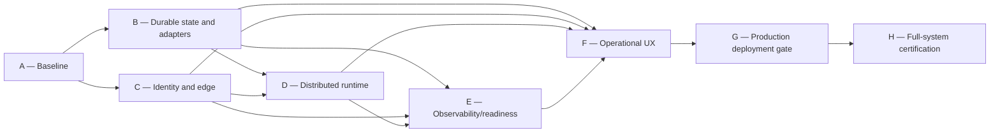

# EPIC-15.5 Strategic Operational Plan

## Strategic intent

EPIC-15.5 turns the ACS from a collection of validated domain, Product API and Control Plane slices into an operable platform. It does not replace the stabilized domains from EPIC-10 through EPIC-15. It supplies the production adapters, trust chain, distributed execution, diagnostics, recovery paths and evidence required to operate those domains safely.

The governing outcome is:

```text
supported operator intent
→ trusted actor and explicit tenant scope
→ governed application command
→ durable state transition
→ remote/target side effect when applicable
→ externally observable outcome
→ supported recovery
→ durable audit/economic evidence
```

## Current-state assessment

The repository is strong in domain modeling and bounded acceptance:

- Tenant, Membership, Authority, Governance, Entitlement and Limit contracts are explicit.
- Agent lifecycle, composition read models, sandbox deployment and runtime lifecycle exist.
- Product API errors, receipts, tenant isolation and governance enforcement are well tested.
- Main Control Plane and Tenant Administration browser routes have acceptance evidence.
- Readiness, evidence, diagnostics, audit and economics have useful projections.

After C01, the active HTTP composition has single-node durable Tenant Administration, audit, secret metadata/references and economics, aligned HTTP methods and a production-oriented OIDC validator, but the overall topology remains non-production:

- production HTTP identity is OIDC/JWT validated; server-owned rate limiting and bounded HTTP edge controls are implemented, with live multi-host edge acceptance still pending;
- Agent, deployment, runtime and worker authoritative state is local to a process; durable adapters are still single-node and unshared;
- Vault and SQLite secret/economic adapters exist, but live managed-service identity/HA and shared settlement/database proof remain absent;
- worker execution is same-process/local;
- audit and telemetry are not durable/shared/exported;
- production deployment is correctly sandbox-gated;
- important composition, execution and recovery journeys are incomplete.

`ACS-ORG-003` and `ACS-ORG-008` are resolved. `ACS-ORG-002` and `ACS-ORG-007` are partially resolved. Runtime start/stop route reachability is corrected, but this does not prove durable or remote execution.

See the 24 findings in `operational-gap-inventory.md`.

## Target state

At EPIC closure, ACS must have explicit environment profiles and refuse an operational/production profile when required adapters are absent. An operator must be able to authenticate, administer a tenant, compose an Agent, bind managed secret references, validate readiness, deploy to an approved target, execute, diagnose and recover through the Product API and one coherent Control Plane. Authoritative state and audit must survive restart and remain consistent across at least two ACS instances. Distributed execution must be proven across a process or network boundary.

Production deployment remains gated until the final target and acceptance evidence are approved.

## Workstreams

### W1 — Durable truth and adapter composition

B01 partially resolved ACS-ORG-001/009 for single-node Tenant Administration. B02 added fail-closed Vault and durable economic boundaries, partially resolving ACS-ORG-002/007. Continue with ACS-ORG-019, live/shared adapter proof and remaining Agent/deployment/runtime/job state; migrate remaining seeded/dev behavior into explicit profiles.

### W2 — Trusted identity and edge

`ACS-ORG-003` was resolved by C01 using OIDC/JWT validation and explicit signed platform mapping. C02 resolved the application edge gap and removed caller-selected/process-local production limiting; shared SQLite counters are proven on one database. Live reverse-proxy, multi-host limiter and IdP topology remain H acceptance work rather than a reason to reopen C01/C02 contracts.

### W3 — Distributed runtime and recovery

Resolve ACS-ORG-004, 005 and runtime portions of 017/019/021. Connect Product API execution intent to a durable dispatcher, authenticated remote workers and recoverable jobs. Preserve tenant/workload isolation and C02 governance enforcement before dispatch.

### W4 — Observability and readiness

Resolve ACS-ORG-011 and 012 and support 018. Export structured telemetry, define actionable dependency diagnostics and implement distinct liveness/readiness endpoints using live adapter health.

### W5 — Operational product journeys

Resolve ACS-ORG-014–018, 022 and 023. Consolidate or securely federate Control Plane surfaces, expose only bounded semantic mutations, add managed secrets and recovery UX, and reconcile stale capability messaging.

### W6 — Production deployment and certification

Resolve ACS-ORG-006 and 020. Add a production target only after B–F gates pass, then certify rollout, rollback, restart, multi-replica, security, recovery and browser journeys.

## Sequencing and dependency order



B and C may run in parallel after their decision gates, but no public mutation surface may be considered secure until C lands. D requires durable job state and trusted worker identity. E requires real dependencies to observe. F consumes all earlier boundaries. G cannot begin by deleting sandbox guards; it begins with a prerequisites review. H is evidence-only except for regression fixes.

## Milestone outcomes

### Milestone A — System-Wide Gap Discovery & Readiness Baseline

- canonical finding inventory;
- state/adapter and journey baselines;
- readiness vocabulary;
- executable stories and gates.

**Exit:** A01 package internally consistent and evidence-backed.

### Milestone B — Durable Platform State & Production Adapters

- B01: single-node durable tenant, membership, governance and audit repositories plus HTTP contract compatibility;
- B02: Vault secret boundary, durable metadata/references, durable economics/settlement, idempotency and reconciliation;
- remaining: shared/production tenant and agent/deployment/runtime repositories;
- shared/append audit and multi-instance economic records;
- live managed-secret service and shared catalog proof;
- explicit development versus operational composition;
- restart and multi-instance state proof.

**Current status:** IN PROGRESS. B01/B02 restart evidence passes, but the milestone exit remains unchanged: no authoritative production resource may depend on a local map or unshared single-node store.

### Milestone C — Production Identity, Security & Edge Controls

- trusted principal validation and explicit platform authority;
- tenant binding from trusted context;
- trusted CORS/request/proxy contract; HTTP method compatibility is already established by B01;
- distributed rate limiting, request bounds and security headers;
- forged-context and abuse tests.

**Exit:** an untrusted client cannot forge actor, tenant or platform authority.

**Current status:** PASS WITH CAVEATS. C01 passes for trusted HTTP identity and authority binding. C02 passes for server-owned limiting, proxy trust, CORS, request bounds, timeouts, security headers and edge readiness. Live IdP/reverse-proxy/multi-host limiter evidence remains H acceptance; global Operational/Production Readiness is still blocked.

### Milestone D — Distributed Runtime & Execution Readiness

- durable job/attempt/lease model;
- authenticated remote worker registration and dispatch;
- retry, cancellation, redelivery and dead-worker recovery;
- Product API execution integration;
- real cross-process proof.

**Exit:** an operation executes remotely without local fallback and recovers from worker/process loss.

### Milestone E — Observability & Operational Diagnostics

- structured external logs, metrics and traces;
- exporter health and redaction;
- dependency-aware readiness and liveness;
- operator diagnostics with actionable cause.

**Exit:** an injected degradation is detected and diagnosed without shell access.

### Milestone F — End-to-End Product UX Operationalization

- one authenticated Control Plane journey;
- composition and managed secret operations;
- complete execution/result/retry/cancel path;
- governed remediation and recovery verification;
- reconciled capability/readiness language.

**Exit:** the approved operational journey completes without direct storage, file edits or hidden curl steps.

### Milestone G — Production Deployment Readiness & Governance Gate

- approved production target adapter;
- target readiness, rollout and rollback;
- production policy replaces sandbox-only only when prerequisites pass;
- canary/failure evidence and operator controls.

**Exit:** a production deployment can be attempted only through an explicit green readiness gate and recovered safely.

### Milestone H — Full-System Acceptance & Gap Closure

- full regression and browser certification;
- restart and multi-replica tests;
- identity/edge adversarial tests;
- remote dispatch and recovery tests;
- closure report and deferred inventory.

**Exit:** evidence supports the final readiness level. H does not add features.

## Decision gates

| Gate | Decision | Alternatives | Required evidence | Blocks |
| --- | --- | --- | --- | --- |
| B1 | Primary durable database/repository strategy | relational DB, equivalent transactional service | tenant partitioning, revisions, append/audit support, migration/backup plan | B implementation |
| B2 | Managed secret provider | Vault/KMS/cloud provider/equivalent | encryption, identity, rotation, availability and local-dev adapter contract | secrets and deploy |
| B3 | Economic settlement persistence/provider boundary | durable internal ledger plus provider, external provider adapter | idempotency, reconciliation, failure behavior; no billing expansion | economics readiness |
| C1 | Identity trust model | OIDC/JWT validation or trusted gateway/mTLS assertion | signature/issuer/audience/expiry/key rotation and local-dev separation | exposed mutations |
| C2 | Distributed rate-limit backend and keying | shared counter service/provider | principal/tenant/IP strategy, proxy policy, failure semantics | edge readiness |
| D1 | Dispatch transport | broker/queue or authenticated RPC with durable command store | delivery, lease fencing, redelivery, ordering and idempotency | remote execution |
| E1 | Telemetry/export standard and backend | OTLP-compatible or equivalent structured exporters | logs/metrics/traces, redaction, exporter health, retention | operational diagnostics |
| F1 | Control Plane consolidation | single build or secure federated applications | one session/actor/nav/error contract | end-to-end UX |
| G1 | Production target and rollout strategy | target provider options | health, secret delivery, capacity, isolation, rollback and ownership | production deploy |

No vendor is selected in A01.

## Acceptance strategy

### Evidence layers

1. **Contract evidence:** types, invariants and semantic errors.
2. **Implementation evidence:** adapter/service integration and application flow.
3. **Operational evidence:** real topology, restart, failure and recovery behavior.
4. **Product evidence:** Product API and browser journey.
5. **Production evidence:** target rollout, observability, capacity/security and rollback.

A milestone cannot use a lower layer as a substitute for a required higher layer.

### Required recurring matrices

- tenant A/B cross-read and cross-mutation denial;
- platform versus tenant authority;
- restart before/during/after mutation;
- two-instance concurrency;
- provider unavailable/slow/partial response;
- worker loss, duplicate delivery and retry exhaustion;
- audit correlation and redaction;
- browser loading/empty/error/forbidden/recovery states;
- no horizontal overflow, page errors or console errors for affected routes.

## Risks and mitigations

| Risk | Impact | Mitigation |
| --- | --- | --- |
| Adapter work becomes a framework rewrite | delayed delivery, new abstractions | implement against named findings and current domain contracts only |
| Durable schema couples every domain | migration and ownership complexity | repository boundaries per aggregate; transaction only where invariants require it |
| Identity implementation creates a second authority model | privilege inconsistencies | validator produces principal; B01 authority remains decision source |
| Remote execution bypasses governance | cross-tenant/unsafe work | enforce authority/governance before durable dispatch and bind tenant/workload in signed assignment |
| Audit failure causes silent unaudited mutation | governance evidence gap | classify critical operations and define fail-closed/transactional outbox semantics |
| Production guard removed early | unsafe live deployment | G gate requires B–F evidence and retains fail-closed default |
| UX duplicates domain rules | drift and bypass | UI consumes Product API actions/read models only |
| Environment `EROFS` hides compile regressions | false validation | distinguish official build blocker from `/tmp` compile evidence; certify in writable CI |

## Objective definition of DONE

EPIC-15.5 is done only when:

1. every BLOCKER/CRITICAL finding is closed or explicitly rejected with evidence;
2. remaining HIGH findings do not break the approved operator journey;
3. production composition cannot select memory/mock/local-only authority silently;
4. identity, tenant scope and platform authority originate from a trusted boundary;
5. critical state survives restart and is coherent across replicas;
6. remote execution and recovery are proven across a real boundary;
7. external diagnostics and traffic readiness use live dependencies;
8. production deployment remains fail-closed until its gate passes;
9. a browser-certified operator journey reaches audit evidence after a real mutation/execution;
10. closure documents state the achieved readiness level and all deferred scope honestly.

Until then, the normative claim remains: **ACS is not Production Ready**.
