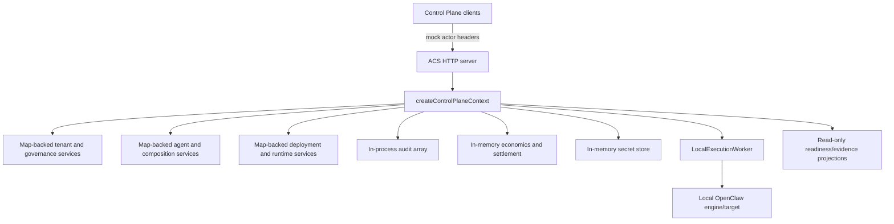
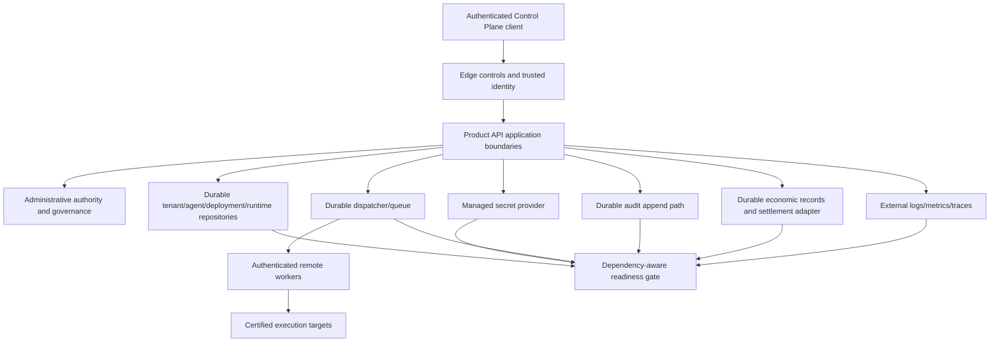

# Architecture Gap Review

## Purpose

This review prevents a recurring classification error: a contract, interface, read model or unit test is not the same as an operational implementation. Each capability is evaluated across four layers:

```text
contract exists
→ implementation exists
→ production adapter exists and is selected
→ operational proof exists
```

## Capability matrix

| Capability | Contract | Implementation | Production adapter | Operational proof | Final assessment |
| --- | --- | --- | --- | --- | --- |
| Tenant lifecycle | Yes | Yes | No durable repository | Domain/API/browser evidence only | PARTIAL |
| Membership/authority | Yes | Yes | No trusted identity or durable repository | Strong negative domain/API tests | PARTIAL |
| Governance/limits/entitlements | Yes | Yes | No durable repository | Evaluator/enforcement tests; HTTP method gap | PARTIAL |
| Agent domain/lifecycle | Yes | Yes | No durable repository | Domain/Product API/browser evidence | PARTIAL |
| Composition resources | Yes | Read projections and compatibility | No mutable production catalog | Mutation journey absent | PARTIAL |
| Secret references | Yes | Yes | No managed secret provider | Redaction/reference tests | PARTIAL |
| Deployment lifecycle | Yes | Sandbox implementation | No production target | Sandbox tests | PARTIAL |
| Runtime lifecycle | Yes | Local engine lifecycle | No durable job store | Local tests; no restart/recovery | PARTIAL |
| Worker registration/assignment | Yes | In-process registry/lease/local worker | No remote dispatcher/broker | Unit/local tests | NOT PROVEN as distributed |
| Audit events/read model | Yes | Yes | No durable append store | Domain/API/browser history in one process | PARTIAL |
| Economics | Yes | In-memory quotes/reservations/settlement | No ledger/settlement adapter | Contract tests | PARTIAL, production BLOCKED |
| HTTP authentication | Mock contract | Header parser | No validator | Mock tests | BLOCKED |
| HTTP authorization | Yes | Yes after actor resolution | Depends on trusted identity | Domain/API negative tests | PARTIAL |
| Rate limiting | Error/context contract | Header-driven mock | No | Mock tests | BLOCKED |
| Telemetry | Event/sink contracts | Memory/JSONL | No external exporter | Local tests | PARTIAL |
| Readiness | Reports/read models | Computed inspection | No traffic gate | Report tests | PARTIAL |
| Main Control Plane | Yes | `.design/app-standalone` | N/A | EPIC-14 browser evidence | READY for accepted UX scope |
| Tenant Administration UI | Yes | `static` app | N/A | EPIC-15 browser evidence | READY for accepted UX scope; operational auth blocked |
| Recovery/remediation | Partial status/error contracts | Mostly read-only | No command/reconcile plane | No end-to-end recovery evidence | BLOCKED |

## Existing architecture to preserve

- Tenant identity and tenant/workload isolation primitives.
- EPIC-15 Tenant, Membership, Administrative Authority, Governance, Entitlement and Limit contracts.
- Default-deny governance and explicit platform-versus-tenant authority.
- Product API as the external Control Plane boundary.
- Engine protocol and execution target abstraction.
- Worker registration/assignment types and explicit isolation scope.
- Audit correlation/redaction and administrative event categories.
- Economic authorization/receipt distinction from billing.
- EPIC-14 navigation, responsive and browser acceptance standards.

Later milestones must replace adapters and connect flows without introducing competing tenant, identity, governance, worker or audit models.

## Current active topology



This is a valid development composition. It is not a production topology because identity, state, execution and evidence share the same process and local filesystem assumptions.

## Target topology boundaries



The diagram is normative only at the boundary level. It does not prescribe a database, cloud, broker or identity vendor.

## Write/read boundaries

| Boundary | Writes | Reads | Rule |
| --- | --- | --- | --- |
| Product API | semantic commands only | stable administrative/operational read models | UI never calls repositories or workers directly. |
| Identity edge | validated principal and scope | token/upstream identity metadata | caller headers cannot construct authority. |
| Domain/application services | lifecycle, membership, governance, deployment and run transitions | aggregates/revisions | business rules remain here. |
| Durable repositories | authoritative state and idempotency records | versioned state | no cache becomes authority. |
| Dispatcher | job, lease, attempt, result transitions | worker/job status | no side effect before durable dispatch intent. |
| Workers | execution result/heartbeat | assigned work and leased secrets | no cross-tenant implicit context. |
| Audit | append-only attributable event | minimized tenant-scoped history | audit failure semantics are explicit. |
| Observability | structured operational signals | dashboards/alerts/diagnostics | telemetry is not authoritative domain state. |

## Gap clusters and root causes

### Development composition is the only composition

`createControlPlaneContext` constructs development adapters directly. There is no configuration profile that validates and selects production adapters. This root cause drives ACS-ORG-001, 002, 007, 009, 010 and 019.

### Trust starts too late

Tenant-scoped authorization and governance are correctly modeled, but the incoming actor is not authenticated. The target is not a new RBAC model; it is a trusted principal boundary feeding the existing authority model.

### Runtime contracts are disconnected from scheduling

Engine and worker contracts exist separately. The normal Product API runtime path calls the engine lifecycle service while assignment/lease logic remains an isolated local subsystem. Milestone D must connect them through one durable application flow rather than adding checks to controllers or workers independently.

### Evidence is derived from ephemeral truth

Audit, readiness, diagnostics and economics projections are useful, but they read process-local structures. Exporters cannot make ephemeral domain state durable. Milestone B must establish truth before Milestone E exports it.

### Surfaces are accepted independently, not as one journey

EPIC-14 and EPIC-15 browser evidence remains valid for their routes. Operational readiness requires a single authenticated journey across tenant administration, agent configuration, execution, diagnostics and recovery. This is integration work, not a redesign.

## Sandbox deployment gate prerequisites

Production deployment may be introduced only after all of the following are certified:

1. durable tenant, agent, deployment and runtime state;
2. managed secrets with rotation and worker-safe delivery;
3. trusted identity and explicit platform authority;
4. distributed rate limiting and edge hardening;
5. authenticated remote worker dispatch with durable jobs and lease fencing;
6. target health, rollout, rollback and failure recovery;
7. durable audit and economic reconciliation;
8. external logs/metrics/traces and dependency-aware readiness;
9. operator UX for deploy, observe, diagnose and recover;
10. restart, multi-instance, security and browser acceptance.

The implementation task is therefore “add a certified production target behind a readiness gate”, not “remove `sandbox` checks”.

## Boundary decisions for future milestones

- **Database/vendor choice:** OPEN DECISION at Milestone B gate. Required characteristics are transactional revisions, tenant partitioning, append support and multi-instance access.
- **Secret provider:** OPEN DECISION at Milestone B gate. A managed provider or equivalent is required; local filesystem is development-only.
- **Identity provider:** OPEN DECISION at Milestone C gate. OIDC/JWT or trusted gateway are alternatives; server-owned verification is mandatory.
- **Rate limiter:** OPEN DECISION at Milestone C gate. Must be distributed and keyed from trusted request context.
- **Dispatcher/broker:** OPEN DECISION at Milestone D gate. Transport is not prescribed; delivery, fencing, idempotency and recovery semantics are.
- **Telemetry backend:** OPEN DECISION at Milestone E gate. Standard structured export and operator diagnostics are required; a generic observability platform is not.
- **Control Plane consolidation:** OPEN DECISION at Milestone F gate between one build and secure federated surfaces. One actor/session/navigation contract is mandatory.

## Architecture acceptance rule

A capability advances from `PARTIAL` to `READY` only when the production adapter is selected in an explicit non-development profile and its required operational proof passes. Documentation, interfaces and static read models remain necessary but insufficient evidence.
