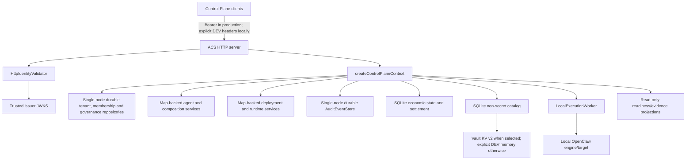
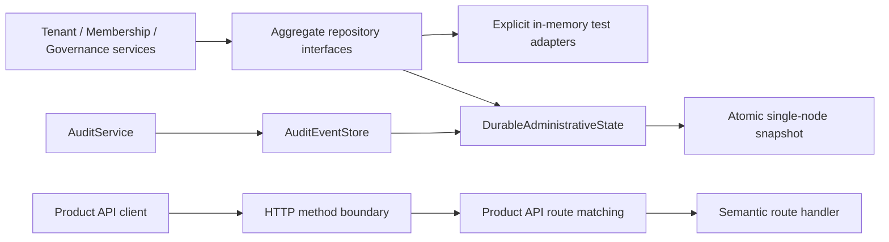
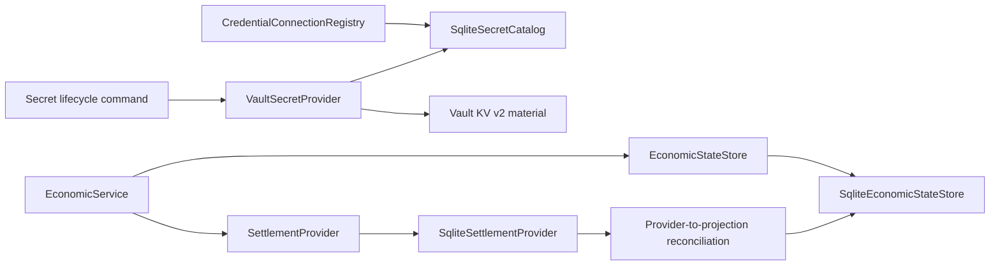
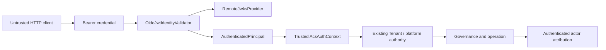
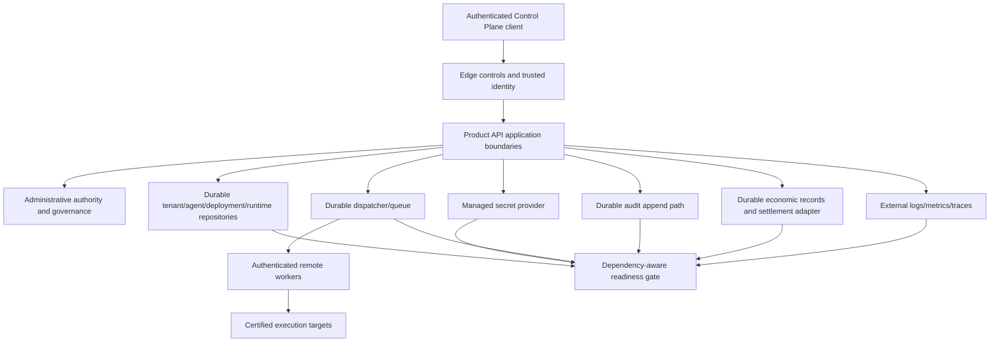

# Architecture Gap Review

## Purpose

This review prevents a recurring classification error: a contract, interface, read model or unit test is not the same as an operational implementation. Each capability is evaluated across four layers:

```text
contract exists
→ implementation exists
→ production adapter exists and is selected
→ operational proof exists
```

## Capability matrix

| Capability | Contract | Implementation | Production adapter | Operational proof | Final assessment |
| --- | --- | --- | --- | --- | --- |
| Tenant lifecycle | Yes | Yes | Single-node durable adapter; no shared production database | Domain/API/browser plus restart/revision proof | PARTIAL |
| Membership/authority | Yes | Yes | Single-node durable adapter fed by trusted HTTP principal | Negative API/auth tests plus restart/atomic owner transfer proof | PARTIAL pending shared state/live IdP |
| Governance/limits/entitlements | Yes | Yes | Single-node durable adapter; no shared production database | Evaluator/enforcement, real HTTP method and restart proof | PARTIAL |
| Agent domain/lifecycle | Yes | Yes | No durable repository | Domain/Product API/browser evidence | PARTIAL |
| Composition resources | Yes | Read projections and compatibility | No mutable production catalog | Mutation journey absent | PARTIAL |
| Secret references | Yes | Tenant-scoped lifecycle plus durable metadata | Vault KV v2 provider; local catalog is single-node | Redaction, isolation, rotation/revoke and restart tests; live HA unproven | PARTIAL |
| Deployment lifecycle | Yes | Sandbox implementation | No production target | Sandbox tests | PARTIAL |
| Runtime lifecycle | Yes | Local engine lifecycle with reachable HTTP start/stop | No durable job store | Handler reachability only; no restart/recovery | PARTIAL |
| Worker registration/assignment | Yes | In-process registry/lease/local worker | No remote dispatcher/broker | Unit/local tests | NOT PROVEN as distributed |
| Audit events/read model | Yes | Durable single-node event store selected by HTTP server | No shared append/retention production service | Restart/correlation proof; replica/outbox unproven | PARTIAL |
| HTTP method contract | Yes | Server, CORS and route layer aligned for GET/POST/PUT/PATCH/DELETE | N/A | Real entry-handler integration tests | READY for method compatibility scope |
| Economics | Yes | Store-backed quotes/reservations/usage/settlement | SQLite economic/settlement adapters; no shared/external provider proof | Restart, idempotency, failure and reconciliation tests | PARTIAL |
| HTTP authentication | `HttpIdentityValidator` | OIDC JWT/JWKS validator plus explicit DEV adapter | Production-oriented adapter selected fail-closed | cryptographic/claims/key-rotation and real HTTP forged-header tests; live IdP unproven | PARTIAL |
| HTTP authorization | Yes | Yes after actor resolution | Depends on trusted identity | Domain/API negative tests | PARTIAL |
| Rate limiting | Error/context contract | Header-driven mock | No | Mock tests | BLOCKED |
| Telemetry | Event/sink contracts | Memory/JSONL | No external exporter | Local tests | PARTIAL |
| Readiness | Reports/read models | Computed inspection | No traffic gate | Report tests | PARTIAL |
| Main Control Plane | Yes | `.design/app-standalone` | N/A | EPIC-14 browser evidence | READY for accepted UX scope |
| Tenant Administration UI | Yes | `static` app | N/A | EPIC-15 browser evidence | READY for accepted UX scope; operational auth blocked |
| Recovery/remediation | Partial status/error contracts | Mostly read-only | No command/reconcile plane | No end-to-end recovery evidence | BLOCKED |

## Existing architecture to preserve

- Tenant identity and tenant/workload isolation primitives.
- EPIC-15 Tenant, Membership, Administrative Authority, Governance, Entitlement and Limit contracts.
- Default-deny governance and explicit platform-versus-tenant authority.
- Product API as the external Control Plane boundary.
- Engine protocol and execution target abstraction.
- Worker registration/assignment types and explicit isolation scope.
- Audit correlation/redaction and administrative event categories.
- Economic authorization/receipt distinction from billing.
- EPIC-14 navigation, responsive and browser acceptance standards.

Later milestones must replace adapters and connect flows without introducing competing tenant, identity, governance, worker or audit models.

## Current active topology



This is a more restart-safe development/single-node composition after C01. Production HTTP identity is now validated, but the whole system is not a production topology because several authoritative aggregates remain process-local, local SQLite/snapshot adapters are not replica-certified, execution is local, edge controls are incomplete and external diagnostics are absent.

## B01 applied boundaries



The administrative file is updated by write-to-temporary-path plus atomic rename. The in-process snapshot is replaced only after the filesystem commit succeeds. Membership ownership transfer uses repository `saveMany`, so the previous and next owner are persisted in one snapshot replacement. A corrupt file fails startup, and a write failure propagates instead of falling back to memory.

These semantics provide restart survivability and per-file atomicity on one node. They do not provide distributed locking, live reload, cross-instance optimistic concurrency, schema migration tooling or a transaction that combines the resource commit and subsequent audit append. The architecture classification is therefore `SINGLE_NODE_DURABLE / MULTI_INSTANCE_NOT_PROVEN`.

## B02 applied boundaries



Secret material and metadata are deliberately separate. The Vault adapter never serializes raw material into the ACS catalog, API or audit event. The SQLite catalog remains the Tenant ownership/version authority, which means its single-node limitation is part of the finding status.

Economic settlement also has two authorities: provider-confirmed effects and the local operational projection. Idempotency prevents duplicate provider effects; an atomic local commit updates settlement, reservation and receipt together; reconciliation repairs a provider-success/local-failure crash window.

## C01 applied boundary



The validator retains only the canonical principal, issuer/method summary, scopes, optional Tenant binding and explicit platform flag. Raw credentials and full claims do not cross the boundary. The DEV header adapter is separate and rejected by production composition. Downstream enforcement no longer maps absent/disabled auth or actor type names to global authority.

## Target topology boundaries



The diagram is normative only at the boundary level. It does not prescribe a database, cloud, broker or identity vendor.

## Write/read boundaries

| Boundary | Writes | Reads | Rule |
| --- | --- | --- | --- |
| Product API | semantic commands only | stable administrative/operational read models | UI never calls repositories or workers directly. |
| Identity edge | validated principal and scope | token/upstream identity metadata | caller headers cannot construct authority. |
| Domain/application services | lifecycle, membership, governance, deployment and run transitions | aggregates/revisions | business rules remain here. |
| Durable repositories | authoritative state and idempotency records | versioned state | no cache becomes authority. |
| Dispatcher | job, lease, attempt, result transitions | worker/job status | no side effect before durable dispatch intent. |
| Workers | execution result/heartbeat | assigned work and leased secrets | no cross-tenant implicit context. |
| Audit | append-only attributable event | minimized tenant-scoped history | audit failure semantics are explicit. |
| Observability | structured operational signals | dashboards/alerts/diagnostics | telemetry is not authoritative domain state. |

## Gap clusters and root causes

### Development composition is the only composition

`createAcsHttpServer` now selects durable administrative state explicitly; direct contexts use memory unless persistence is requested. There is still no operational profile that validates and selects production adapters for Agents, secrets, deployments, runtime, economics, rate limiting or remote workers. The root cause is reduced for ACS-ORG-001/009 but remains for 002, 007, 010, 019 and the residual state scope.

### Trust starts too late

Tenant-scoped authorization and governance are correctly modeled, but the incoming actor is not authenticated. The target is not a new RBAC model; it is a trusted principal boundary feeding the existing authority model.

### Runtime contracts are disconnected from scheduling

Engine and worker contracts exist separately. The normal Product API runtime path calls the engine lifecycle service while assignment/lease logic remains an isolated local subsystem. Milestone D must connect them through one durable application flow rather than adding checks to controllers or workers independently.

### Evidence is derived from ephemeral truth

Administrative audit, secret metadata/references and economics now survive single-node restart. Readiness consumes selected adapter signals and secret health, but diagnostics and operational runtime projections still depend on process-local structures. Exporters cannot make those remaining ephemeral sources durable; later Milestone B/D work must establish truth before Milestone E exports it.

### Surfaces are accepted independently, not as one journey

EPIC-14 and EPIC-15 browser evidence remains valid for their routes. Operational readiness requires a single authenticated journey across tenant administration, agent configuration, execution, diagnostics and recovery. This is integration work, not a redesign.

## Sandbox deployment gate prerequisites

Production deployment may be introduced only after all of the following are certified:

1. durable tenant, agent, deployment and runtime state;
2. managed secrets with rotation and worker-safe delivery;
3. trusted identity and explicit platform authority;
4. distributed rate limiting and edge hardening;
5. authenticated remote worker dispatch with durable jobs and lease fencing;
6. target health, rollout, rollback and failure recovery;
7. durable audit and economic reconciliation;
8. external logs/metrics/traces and dependency-aware readiness;
9. operator UX for deploy, observe, diagnose and recover;
10. restart, multi-instance, security and browser acceptance.

The implementation task is therefore “add a certified production target behind a readiness gate”, not “remove `sandbox` checks”.

## Boundary decisions for future milestones

- **Database/vendor choice:** SQLite is adopted for bounded single-node B02 durability; a shared production database remains an OPEN DECISION at the B03/B04 gate. Required characteristics are transactional revisions, tenant partitioning, append support and multi-instance access.
- **Secret provider:** Vault KV v2 is the implemented production-oriented provider boundary. Live deployment/HA/service identity and whether metadata moves to a shared database remain OPEN DECISIONS; local filesystem is development-only.
- **Identity provider deployment:** protocol decision is CLOSED for the active HTTP boundary: interoperable OIDC/JWT with RS256/JWKS and server-owned verification. Vendor/live issuer selection and deployment acceptance remain environment decisions.
- **Rate limiter:** OPEN DECISION at Milestone C gate. Must be distributed and keyed from trusted request context.
- **Dispatcher/broker:** OPEN DECISION at Milestone D gate. Transport is not prescribed; delivery, fencing, idempotency and recovery semantics are.
- **Telemetry backend:** OPEN DECISION at Milestone E gate. Standard structured export and operator diagnostics are required; a generic observability platform is not.
- **Control Plane consolidation:** OPEN DECISION at Milestone F gate between one build and secure federated surfaces. One actor/session/navigation contract is mandatory.

## Architecture acceptance rule

A capability advances from `PARTIAL` to `READY` only when the production adapter is selected in an explicit non-development profile and its required operational proof passes. Documentation, interfaces and static read models remain necessary but insufficient evidence.
