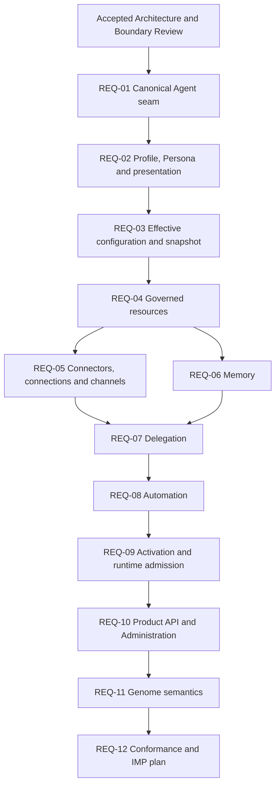

# EPIC-17 Dependency Graph

**Status:** `COMPLETE / ACCEPTED`
**Baseline:** `08b9355c41c635910bade3700f81c03d36c8db50`
**Authority:** documentation and REQ sequencing only
**Implementation authority:** none

## 1. Accepted sequence

The graph groups all 76 dispositions by ownership and boundary. It orders the
decisions that unlock other decisions and does not turn each capability into an
independent feature.



```text
REQ-01  Canonical Agent seam
  -> REQ-02  Profile / Persona
  -> REQ-03  Effective Configuration / Snapshot
  -> REQ-04  Governed Resources
       -> REQ-05  Connectors --+
       -> REQ-06  Memory -------+-> REQ-07 Delegation
                                    -> REQ-08 Automation
                                    -> REQ-09 Activation / Runtime
                                    -> REQ-10 API / Administration
                                    -> REQ-11 Genome semantics
                                    -> REQ-12 Conformance / IMP plan
```

## 2. Dependency decisions

| REQ | Hard prerequisites | Boundary unlocked |
| --- | --- | --- |
| `REQ-01` | Accepted review and decomposition | One canonical Agent identity, lifecycle, revision and lineage reference for every downstream REQ. |
| `REQ-02` | `REQ-01` accepted | Profile, Persona and presentation can be resolved without creating another Agent or operational grant source. |
| `REQ-03` | `REQ-01`, `REQ-02` accepted | Configuration precedence and historically reproducible execution snapshot can refer to settled Agent and presentation ownership. |
| `REQ-04` | `REQ-01`, `REQ-03` accepted | Governed model, Skill, Tool, MCP and capability references gain one owner and revision boundary. |
| `REQ-05` | `REQ-03`, `REQ-04` accepted | Connector, Connection, credential and Channel boundaries can be tested against accepted resource and configuration semantics. |
| `REQ-06` | `REQ-01`, `REQ-03`, `REQ-04` accepted | Memory policy and store ownership can be separated from Agent identity, runtime state, Knowledge and Evidence. |
| `REQ-07` | `REQ-01`, `REQ-03`, `REQ-04`, `REQ-05`, `REQ-06` accepted | Delegation can attenuate settled resource, Connector, credential, Channel and Memory authority. |
| `REQ-08` | `REQ-01`, `REQ-03`, `REQ-04`, `REQ-07` accepted | Automation identity and revision semantics can target canonical Agents and bounded delegation. |
| `REQ-09` | `REQ-03`, `REQ-07`, `REQ-08` accepted | Activation can compile deterministic intent into existing admission/runtime without redefining execution. |
| `REQ-10` | `REQ-02` through `REQ-09` accepted | Product API and Administration can project accepted domains without originating truth. |
| `REQ-11` | `REQ-01` through `REQ-04`, `REQ-10` accepted | Genome traits, assets and verification semantics can reference accepted canonical and presentation state. |
| `REQ-12` | `REQ-01` through `REQ-11` accepted or explicitly blocked/deferred | Cross-domain conformance can produce a candidate IMP plan for a separate CTO gate. |

## 3. Parallel planning window

`REQ-05` and `REQ-06` may execute independently after `REQ-04` is accepted.
Both must be accepted before `REQ-07` becomes ready. Their parallel position
does not authorize either REQ to assume ownership of the other.

## 4. Queue policy

```text
PLANNED
  -> dependencies satisfied
  -> READY
  -> REQ execution
  -> validated REQ commit
  -> CTO acceptance
```

Queue presence is not execution readiness. An agent that encounters an
unaccepted dependency stops, reports the dependency and keeps the downstream
REQ blocked. Each REQ must close in its own commit.

## 5. Blocker edges

Any REQ that requires an incompatible change to Agent identity or lineage,
Workforce, WorkforceRevision, slots, membership, admission, Workflow, Run,
Task, Assignment, Attempt, runtime ownership, Evidence, Cost, shared
PostgreSQL, events, outbox, idempotency, Product API authority, Tenant or
governance boundaries stops with an EPIC-17 blocker and architecture
escalation.

No graph node authorizes implementation, migration, schema, table, endpoint,
UI, provider or production changes.

## 6. Current gate

```text
REQ-01: COMPLETE / ACCEPTED
REQ-02: COMPLETE / ACCEPTED
REQ-03: COMPLETE / ACCEPTED
REQ-04: COMPLETE / ACCEPTED
REQ-05: COMPLETE / ACCEPTED
REQ-06: COMPLETE / ACCEPTED
REQ-07: COMPLETE / ACCEPTED
REQ-08: COMPLETE / ACCEPTED
REQ-09: COMPLETE / ACCEPTED
REQ-10: COMPLETE / ACCEPTED
REQ-11: COMPLETE / ACCEPTED
REQ-12: COMPLETE / ACCEPTED
ARCHITECTURE/SPECIFICATION: COMPLETE / ACCEPTED
IMP-01 through IMP-06: COMPLETE / CTO ACCEPTED / PUBLISHED OR CLOSED
POST-IMP-06 DEPENDENCY GATE: COMPLETE / READY FOR CTO REVIEW
IMP-07: CANDIDATE / READY FOR CTO IMPLEMENTATION GATE
Implementation authority: NONE
```
