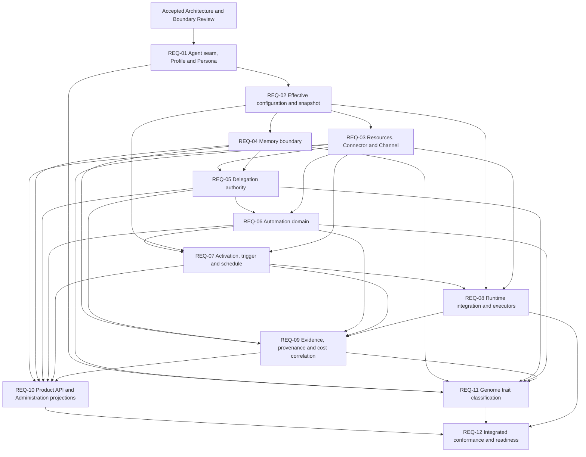

# EPIC-17 Dependency Graph

**Status:** `COMPLETE / PLANNING BASELINE`
**Authority:** documentation and REQ sequencing only
**Implementation authority:** none

## 1. Derivation rule

The graph groups the 76 accepted dispositions by canonical owner and boundary,
then orders the decisions that unlock other decisions. It does not convert each
capability into a feature. `REUSE` rows become invariants, `ADAPT` and `EXTEND`
rows identify bounded contract questions, `NEW` rows identify ownership gaps,
and `REJECT` rows become negative acceptance gates.

The four structural seams govern the critical path:

1. Native and legacy Agent representations coexist.
2. Profile presentation currently contributes to effective capabilities.
3. runtime effective configuration is captured but structurally untyped.
4. Resources/Connector, Memory and Automation lack sufficient canonical
   boundaries; Delegation lacks an authority relationship.

## 2. Dependency graph



## 3. Unlock analysis

| Decision node | Hard prerequisites | What it unlocks | Why the dependency is hard |
| --- | --- | --- | --- |
| `REQ-01` | Accepted review | All later REQs | Every later reference must target the canonical Agent seam and must not inherit the Profile capability contradiction. |
| `REQ-02` | `REQ-01` | Resource, Memory, Delegation, Automation and runtime decisions | Lower-layer authority and historical reconstruction cannot be specified until effective-configuration semantics are frozen. |
| `REQ-03` | `REQ-02` | Delegation, Automation, runtime adapters and projections | Models, skills, tools, capabilities, connectors, connections, credentials and Channels need one reconciled reference boundary. |
| `REQ-04` | `REQ-02` | Delegation, Evidence and application projections | Memory authority, privacy, retention and deletion must be explicit before shared or delegated access is considered. |
| `REQ-05` | `REQ-03`, `REQ-04` | Automation authority and cross-domain evidence | Delegation must attenuate accepted resource and Memory authority between canonical Agents. |
| `REQ-06` | `REQ-03`, `REQ-05` | Activation and scheduling | Activation cannot exist before Automation identity, lifecycle, authority and target semantics are known. |
| `REQ-07` | `REQ-02`, `REQ-03`, `REQ-06` | Runtime integration and operational correlation | Trigger normalization, idempotency and due-work recovery require accepted Automation and configuration references. |
| `REQ-08` | `REQ-02`, `REQ-03`, `REQ-07` | Complete Evidence/Cost correlation and final conformance | Runtime must receive ACS-owned intent and preserve snapshots without becoming an Automation owner. |
| `REQ-09` | `REQ-04` through `REQ-08` | Product/API projections, traits and acceptance | Evidence subjects and Cost correlations depend on the identities and execution seams they describe. |
| `REQ-10` | `REQ-03` through `REQ-07`, `REQ-09` | Integrated operator acceptance | Administration can project only accepted contracts and cannot establish their truth. |
| `REQ-11` | `REQ-01`, `REQ-03` through `REQ-06`, `REQ-09` | Final conformance | Traits can classify only canonical, provenance-bearing state accepted by earlier REQs. |
| `REQ-12` | `REQ-01` through `REQ-11` | A future IMP planning decision | Implementation readiness requires one cross-domain proof that all frozen boundaries compose without authority duplication. |

## 4. Planning windows

After `REQ-02`, `REQ-03` and `REQ-04` may be authored in parallel because both
consume the frozen configuration model and neither may silently own the other.
They must both be accepted before `REQ-05` closes.

After `REQ-08`, projection analysis for `REQ-10` and trait vocabulary analysis
for `REQ-11` may proceed in parallel, but neither can close before `REQ-09`
freezes cross-domain Evidence, provenance and Cost correlation.

## 5. Critical path

```text
Architecture Review accepted
  -> REQ-01 canonical Agent/Profile seam
  -> REQ-02 effective configuration snapshot
  -> REQ-03 resources/connectors + REQ-04 Memory
  -> REQ-05 delegation authority
  -> REQ-06 Automation domain
  -> REQ-07 activation and admission
  -> REQ-08 runtime integration
  -> REQ-09 evidence and cost correlation
  -> REQ-10 projections + REQ-11 traits
  -> REQ-12 integrated readiness
```

## 6. Blocker edges

Any REQ that requires an incompatible change to Agent identity or lineage,
Workforce, WorkforceRevision, slots, membership, admission, Workflow, Run,
Task, Assignment, Attempt, runtime ownership, Evidence, Cost, shared
PostgreSQL, events, outbox, idempotency, Product API authority, Tenant or
governance boundaries stops with an EPIC-17 blocker and architecture
escalation.

No graph node authorizes implementation, migration, schema, table, endpoint,
UI, provider or production changes.
